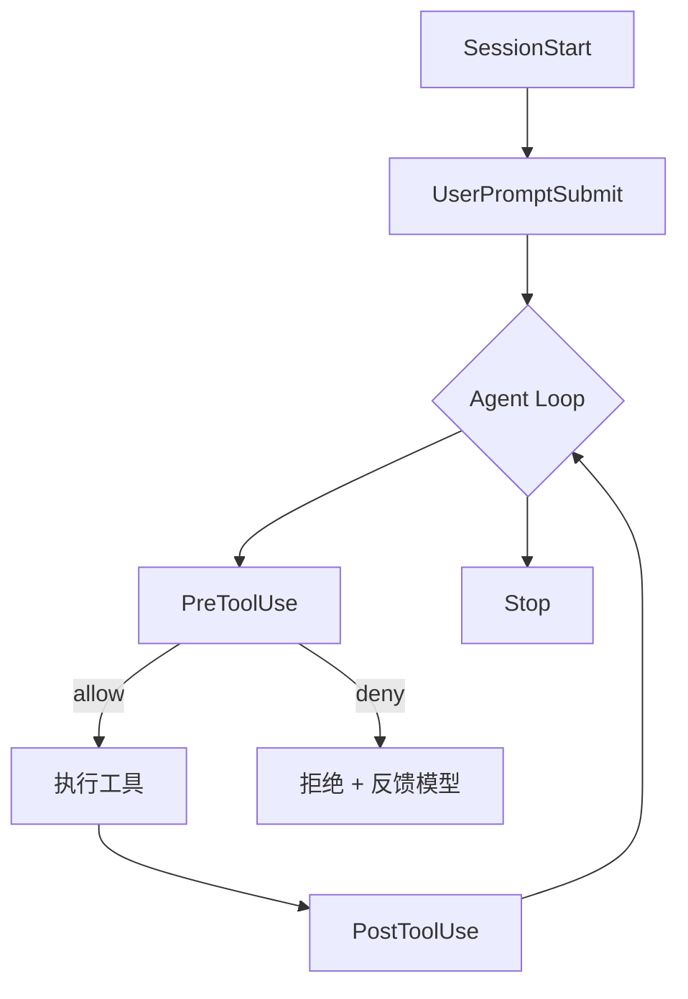

## 什么是 Hooks

**Hooks** 是 Claude Agent 提供的生命周期钩子机制。它允许你在 Agent 执行过程的关键事件上挂载自定义逻辑，实现：

- 执行前校验（安全卫士）
- 执行后处理（格式化、通知）
- 自动化触发（文件变更跑测试）
- 注入上下文（追加信息）

与 Tools / Skills 不同，**Hooks 是"发生了 X 就必须 Y"的确定性规则**，由 harness（宿主环境）执行，**不受模型自由裁量**。

<Note>
Hooks 最重要的性质：**harness 执行，不是 Claude 执行**。这意味着它们 100% 会被触发，适合作安全边界和自动化流水线。
</Note>

## 为什么需要 Hooks

考虑场景："每次修改 `.ts` 文件后自动跑 `prettier`"。

用 skill / 提示词实现：
- Agent 可能忘记
- Agent 可能选择跳过
- 很难保证 100% 执行

用 Hook 实现：
- 只要匹配 `PostToolUse: Edit`，harness 强制执行 prettier
- 模型无法绕过

Hooks 是把"流程约束"从提示词下沉到基础设施层的利器。

## 事件类型

Claude Agent 定义了一套标准事件，主要包括：

| 事件 | 触发时机 | 典型用途 |
|------|---------|---------|
| `SessionStart` | 会话初始化 | 注入初始上下文 / 日志 |
| `UserPromptSubmit` | 用户发送消息 | 过滤/改写/拦截 prompt |
| `PreToolUse` | 工具调用前 | 权限校验 / 参数审计 |
| `PostToolUse` | 工具调用后 | 格式化 / 验证 / 通知 |
| `Notification` | Agent 发送通知 | 桌面提醒 / 消息推送 |
| `Stop` | 会话结束 | 清理 / 汇总 / 保存 |
| `SubagentStop` | 子代理结束 | 聚合结果 |



## 配置位置

Hooks 通过配置文件声明，通常放在：

- **项目级**：`.claude/settings.json`
- **用户级**：`~/.claude/settings.json`

```json
{
  "hooks": {
    "PostToolUse": [
      {
        "matcher": "Edit|Write",
        "hooks": [
          {
            "type": "command",
            "command": "prettier --write \"$CLAUDE_FILE_PATH\""
          }
        ]
      }
    ],
    "PreToolUse": [
      {
        "matcher": "Bash",
        "hooks": [
          {
            "type": "command",
            "command": "bash .claude/hooks/guard-bash.sh"
          }
        ]
      }
    ]
  }
}
```

字段说明：

- **事件名** → 数组，可以配置多组规则
- **`matcher`** → 正则，匹配工具名；不填则匹配所有
- **`hooks`** → 实际执行的命令列表
- **`type: command`** → 当前主流类型，执行 shell 命令

## 数据流

当 hook 被触发时，harness 会：

1. **把事件数据序列化成 JSON**，通过 stdin 传给 hook 进程
2. **设置环境变量**，例如 `CLAUDE_FILE_PATH`、`CLAUDE_TOOL_NAME`
3. **等待 hook 退出**，读取 stdout 和 exit code
4. **根据退出码决定后续行为**：
   - `0`：继续正常流程
   - 非 `0`：对 `PreToolUse` 表示"拒绝"，对其他事件表示"警告但继续"
5. **将 hook 的 stdout 反馈给模型**（可选，取决于 hook 实现）

## 示例 1：危险命令卫士

拦截 `rm -rf`、`sudo` 等命令：

```bash
#!/usr/bin/env bash
# .claude/hooks/guard-bash.sh

# 从 stdin 读取 JSON
input=$(cat)
command=$(echo "$input" | jq -r '.tool_input.command // ""')

deny_patterns=(
  "rm -rf /"
  "rm -rf \~"
  ":\(\)\{.*\|.*\&\};:"  # fork bomb
  "curl.*\| *sh"
  "wget.*\| *bash"
)

for pattern in "${deny_patterns[@]}"; do
  if echo "$command" | grep -qE "$pattern"; then
    echo "❌ 禁止执行危险命令: $pattern"
    exit 1  # 非 0 退出码 = 拒绝
  fi
done

exit 0
```

在 `settings.json` 里挂载：

```json
{
  "hooks": {
    "PreToolUse": [{
      "matcher": "Bash",
      "hooks": [{ "type": "command", "command": "bash .claude/hooks/guard-bash.sh" }]
    }]
  }
}
```

效果：只要 Agent 想跑危险命令，无论模型怎么被说服都会被 hook 挡住。

## 示例 2：编辑后自动格式化

```json
{
  "hooks": {
    "PostToolUse": [
      {
        "matcher": "Edit|Write",
        "hooks": [
          {
            "type": "command",
            "command": "node .claude/hooks/format.mjs"
          }
        ]
      }
    ]
  }
}
```

```js
// .claude/hooks/format.mjs
import { execSync } from "node:child_process"

const input = JSON.parse(await new Response(process.stdin).text())
const file = input.tool_input.file_path

if (!file) process.exit(0)

const ext = file.split(".").pop()
const formatters = {
  ts: `prettier --write "${file}"`,
  js: `prettier --write "${file}"`,
  py: `ruff format "${file}"`,
  go: `gofmt -w "${file}"`,
}

const cmd = formatters[ext]
if (cmd) {
  try {
    execSync(cmd, { stdio: "inherit" })
  } catch {
    // 不打断流程
  }
}
process.exit(0)
```

现在 Agent 每写完一个文件都会自动格式化，无需再在提示里提醒。

## 示例 3：提交前跑测试

```json
{
  "hooks": {
    "PreToolUse": [
      {
        "matcher": "Bash",
        "hooks": [{
          "type": "command",
          "command": "bash .claude/hooks/pre-commit-guard.sh"
        }]
      }
    ]
  }
}
```

```bash
#!/usr/bin/env bash
input=$(cat)
cmd=$(echo "$input" | jq -r '.tool_input.command')

# 只对 git commit 命令生效
if echo "$cmd" | grep -q "git commit"; then
  if ! npm test --silent; then
    echo "❌ 测试未通过，拒绝提交。请先修复测试。"
    exit 1
  fi
fi
exit 0
```

## 示例 4：SessionStart 注入项目上下文

```json
{
  "hooks": {
    "SessionStart": [{
      "hooks": [{
        "type": "command",
        "command": "cat .claude/project-context.md"
      }]
    }]
  }
}
```

hook 的 stdout 会作为系统消息注入到会话中，让 Agent 一开始就"知道"项目上下文。

## 示例 5：Stop 事件发送通知

```json
{
  "hooks": {
    "Stop": [{
      "hooks": [{
        "type": "command",
        "command": "osascript -e 'display notification \"Agent 任务完成\" with title \"Claude\"'"
      }]
    }]
  }
}
```

长跑任务结束后桌面弹窗提醒。

## Hooks vs 其他机制对比

| 机制 | 谁执行 | 确定性 | 典型用途 |
|------|--------|--------|---------|
| **提示词指令** | 模型 | 低 | 柔性引导 |
| **Tools** | 模型 | 中 | 提供能力 |
| **Skills** | 模型 | 中 | 提供方法论 |
| **Hooks** | Harness | 高 | 强制规则 |

一句话总结：**想"告诉" Agent 做什么 → Skills；想"强迫" Agent 必须这样 → Hooks**。

## 设计原则

### 原则 1：幂等

Hook 可能被重复触发（重试场景）。确保多次执行不会出问题：

```bash
# ❌ 追加日志
echo "$msg" >> log.txt

# ✅ 幂等：只记录新事件
if ! grep -q "$event_id" log.txt; then
  echo "$msg" >> log.txt
fi
```

### 原则 2：快速

Hooks 会被频繁触发，耗时过长会拖慢整个 Agent。目标：

- 99 分位 < 500ms
- 不要在 hook 里跑大模型推理 / 长 IO

需要慢操作时，异步化：

```bash
# 后台执行，不阻塞 hook
(slow-command &)
exit 0
```

### 原则 3：失败要降级

Hook 本身可能出错。选择合适的失败策略：

- **安全卫士**：失败 = 拒绝（默认）
- **格式化/通知**：失败 = 忽略继续

```bash
# 非关键 hook
set +e
prettier --write "$file" 2>/dev/null || true
exit 0
```

### 原则 4：可观测

记录 hook 的触发和结果，方便排查：

```bash
log_file=".claude/hooks/hook.log"
echo "$(date +%s) $EVENT $TOOL_NAME exit=$?" >> "$log_file"
```

### 原则 5：别写业务逻辑

Hook 是**策略**，不是**业务**。业务逻辑应该在 skill / tool / subagent 里，hook 只负责"是否允许"和"事后处理"。

## 调试技巧

### 看 harness 日志

Claude Code / Agent SDK 都会把 hook 触发记录在日志里（通常在 `~/.claude/logs/` 或 stderr）。

### 单独测试 hook

```bash
# 模拟 harness 调用
echo '{"tool_name":"Bash","tool_input":{"command":"rm -rf /"}}' | bash .claude/hooks/guard-bash.sh
echo "exit: $?"
```

### 加详细日志

调试期在 hook 开头加：

```bash
exec 2> >(tee -a /tmp/hook-debug.log >&2)
set -x
```

事后清理掉。

## 安全注意事项

Hooks 是双刃剑，使用不当会带来风险：

- ❌ **不要**在 hook 里执行来自模型输出的命令（命令注入风险）
- ❌ **不要**把 hook 脚本放在可写目录但权限过宽
- ❌ **不要**让 hook 读写敏感数据后通过 stdout 反馈给模型
- ✅ **要**对用户输入 / 模型输入做严格转义
- ✅ **要**把 hook 纳入 Code Review

## 常见自动化模式

| 模式 | 用途 |
|------|------|
| `PreToolUse Bash` + 黑名单 | 命令白/黑名单 |
| `PostToolUse Edit` + 格式化 | 自动整洁代码 |
| `PostToolUse Write` + 类型检查 | 写完就 tsc / mypy |
| `Stop` + 通知 | 长任务完成提醒 |
| `SessionStart` + 上下文注入 | 项目记忆 |
| `UserPromptSubmit` + 转义 | 防止 prompt 注入 |
| `SubagentStop` + 聚合 | 多 agent 收尾 |

## 小结

Hooks 是 Agent 时代的"**基础设施级约束**"：

- **Harness 执行**，确定性强
- **事件驱动**，生命周期完整
- **低侵入**，配置化声明
- **可组合**，与 Skills / Tools / MCP 正交

把"必须发生的事"写成 Hook，把"该怎么做的事"写成 Skill，把"能执行的动作"写成 Tool——这就是一个健壮 Agent 系统的分层方式。

下一章 [Subagents](/ai/agent/subagents) 将介绍如何用子代理并行处理复杂任务。
