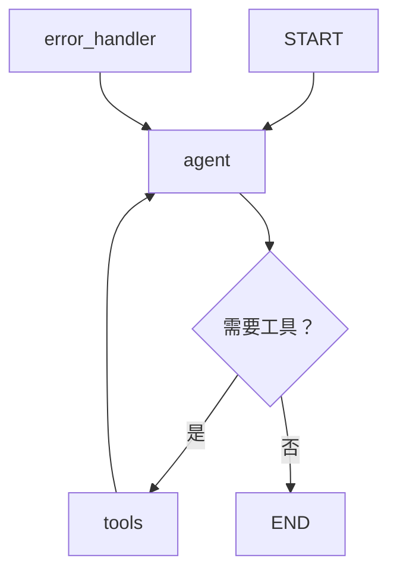

## 项目概述

本章将使用 **LangGraph** 从零构建一个完整的 ReAct Agent。该 Agent 具备以下能力：

- **网络搜索**：从互联网获取最新信息
- **数学计算**：执行复杂数学运算
- **代码执行**：运行 Python 代码并返回结果
- **对话记忆**：记住历史对话上下文
- **错误恢复**：工具调用失败时自动重试

最终我们会得到一个可以部署为 API 服务的 Agent 系统。

## 环境准备

### 安装依赖

```bash
pip install langgraph langchain-openai langchain-community tavily-python
```

### 环境变量配置

```bash
export OPENAI_API_KEY="sk-your-api-key"
export TAVILY_API_KEY="tvly-your-api-key"  # 用于网络搜索
```

<Note>
本实战使用 OpenAI 的 GPT-4o 作为基础模型，你也可以替换为 Anthropic Claude 或其他支持工具调用的模型。Tavily 是一个专为 AI Agent 设计的搜索引擎 API，提供免费额度。
</Note>

### 项目结构

```
ai-agent-project/
├── agent/
│   ├── __init__.py
│   ├── state.py          # 状态定义
│   ├── tools.py          # 工具定义
│   ├── nodes.py          # 图节点
│   └── graph.py          # 图编排
├── server.py             # API 服务
├── test_agent.py         # 测试
└── requirements.txt
```

## 第一步：定义状态

Agent 的状态是在整个工作流中流转的数据结构。我们需要定义哪些信息需要在节点之间传递。

```python
# agent/state.py
from typing import Annotated, TypedDict
from langgraph.graph.message import add_messages


class AgentState(TypedDict):
    """Agent 状态定义

    Attributes:
        messages: 对话消息历史，使用 add_messages reducer 自动追加
        tool_call_count: 当前轮次的工具调用计数，用于防止无限循环
        error_count: 连续错误计数，用于错误恢复决策
    """
    messages: Annotated[list, add_messages]
    tool_call_count: int
    error_count: int
```

<Tip>
`Annotated[list, add_messages]` 中的 `add_messages` 是 LangGraph 提供的 reducer 函数。它确保新消息被**追加**到列表中而非覆盖，并且能正确处理工具调用消息的匹配。
</Tip>

## 第二步：定义工具

工具是 Agent 与外部世界交互的接口。我们为 Agent 配备三个实用工具。

```python
# agent/tools.py
import math
import traceback
from langchain_core.tools import tool
from langchain_community.tools.tavily_search import TavilySearchResults


# 工具 1：网络搜索
search_tool = TavilySearchResults(
    max_results=3,
    search_depth="advanced",
    include_answer=True,
    description="搜索互联网获取最新信息。当用户询问实时新闻、最新数据、不确定的事实时使用此工具。"
)


# 工具 2：数学计算
@tool
def calculator(expression: str) -> str:
    """执行数学计算。支持基本四则运算、幂运算、三角函数、对数等。

    Args:
        expression: 数学表达式，如 "2**10"、"math.sqrt(144)"、"math.log(100, 10)"

    Examples:
        - "2 + 3 * 4" → "14"
        - "math.pi * 5**2" → "78.53981633974483"
        - "math.factorial(10)" → "3628800"
    """
    # 安全的计算环境：只允许 math 模块的函数
    allowed_names = {
        k: v for k, v in math.__dict__.items()
        if not k.startswith("_")
    }
    allowed_names["abs"] = abs
    allowed_names["round"] = round
    allowed_names["math"] = math

    try:
        result = eval(expression, {"__builtins__": {}}, allowed_names)
        return f"计算结果: {result}"
    except ZeroDivisionError:
        return "错误: 除数不能为零"
    except Exception as e:
        return f"计算错误: {type(e).__name__}: {e}"


# 工具 3：Python 代码执行
@tool
def execute_python(code: str) -> str:
    """执行 Python 代码并返回输出结果。适用于数据处理、字符串操作、列表排序等需要编程解决的任务。

    Args:
        code: 要执行的 Python 代码。代码的 print() 输出和最后一个表达式的值会被返回。

    Note:
        代码在沙箱环境中执行，不能访问文件系统和网络。执行时间限制为 10 秒。
    """
    import io
    import contextlib
    import signal

    # 超时处理
    def timeout_handler(signum, frame):
        raise TimeoutError("代码执行超时（10秒限制）")

    output = io.StringIO()
    try:
        signal.signal(signal.SIGALRM, timeout_handler)
        signal.alarm(10)

        with contextlib.redirect_stdout(output):
            # 限制可用的内置函数
            safe_builtins = {
                "print": print, "len": len, "range": range,
                "int": int, "float": float, "str": str,
                "list": list, "dict": dict, "set": set, "tuple": tuple,
                "sorted": sorted, "reversed": reversed, "enumerate": enumerate,
                "zip": zip, "map": map, "filter": filter,
                "sum": sum, "min": min, "max": max, "abs": abs,
                "round": round, "isinstance": isinstance, "type": type,
                "True": True, "False": False, "None": None,
            }
            exec(code, {"__builtins__": safe_builtins})

        signal.alarm(0)
        result = output.getvalue()
        return result if result else "代码执行成功（无输出）"

    except TimeoutError as e:
        return str(e)
    except Exception:
        signal.alarm(0)
        return f"执行错误:\n{traceback.format_exc()}"


# 汇总所有工具
all_tools = [search_tool, calculator, execute_python]
```

<Warning>
`execute_python` 工具在生产环境中需要更严格的沙箱隔离（如 Docker 容器、gVisor 等）。上面的示例仅做了基本的安全限制，不适合直接用于面向用户的生产系统。
</Warning>

## 第三步：定义图节点

节点是 Agent 工作流中的执行单元。我们定义三个核心节点：Agent 推理、工具执行、错误处理。

```python
# agent/nodes.py
from langchain_openai import ChatOpenAI
from langgraph.prebuilt import ToolNode
from langchain_core.messages import AIMessage, SystemMessage
from agent.state import AgentState
from agent.tools import all_tools

# 配置 LLM
llm = ChatOpenAI(
    model="gpt-4o",
    temperature=0,  # Agent 场景建议使用低温度，提高确定性
).bind_tools(all_tools)

# 系统提示词
SYSTEM_PROMPT = """你是一个强大的 AI 助手，能够使用工具来帮助用户完成各种任务。

工作准则：
1. 仔细理解用户需求，必要时主动澄清
2. 将复杂任务分解为小步骤，逐步完成
3. 优先使用工具获取准确信息，避免猜测
4. 如果工具调用失败，分析原因并尝试其他方案
5. 在最终回答中综合所有信息，给出清晰、有条理的回复

注意事项：
- 数学计算请使用 calculator 工具，不要心算
- 需要多步处理的数据任务请使用 execute_python 工具
- 关于实时信息（新闻、价格、天气等）请使用搜索工具
"""


def agent_node(state: AgentState) -> dict:
    """Agent 推理节点：调用 LLM 进行思考和决策"""
    messages = state["messages"]

    # 确保系统提示词在消息列表开头
    if not messages or not isinstance(messages[0], SystemMessage):
        messages = [SystemMessage(content=SYSTEM_PROMPT)] + messages

    response = llm.invoke(messages)

    # 更新工具调用计数
    tool_call_count = state.get("tool_call_count", 0)
    if response.tool_calls:
        tool_call_count += len(response.tool_calls)

    return {
        "messages": [response],
        "tool_call_count": tool_call_count,
        "error_count": 0  # 成功调用时重置错误计数
    }


# 工具执行节点（使用 LangGraph 内置的 ToolNode）
tool_node = ToolNode(all_tools)


def error_handler_node(state: AgentState) -> dict:
    """错误处理节点：当工具调用失败时提供恢复策略"""
    error_count = state.get("error_count", 0) + 1

    if error_count >= 3:
        # 连续失败 3 次，放弃工具调用，直接回复
        error_message = AIMessage(
            content="抱歉，工具调用多次失败。让我尝试直接根据已有信息回答您的问题。"
        )
    else:
        error_message = AIMessage(
            content=f"工具调用出现问题（第 {error_count} 次），正在重试..."
        )

    return {
        "messages": [error_message],
        "error_count": error_count
    }
```

## 第四步：编排工作流图

这是核心步骤——将所有节点通过边连接起来，形成完整的 Agent 工作流。

```python
# agent/graph.py
from langgraph.graph import StateGraph, START, END
from langgraph.checkpoint.memory import MemorySaver
from agent.state import AgentState
from agent.nodes import agent_node, tool_node, error_handler_node

# 最大工具调用次数限制
MAX_TOOL_CALLS = 15


def should_continue(state: AgentState) -> str:
    """条件边：决定 Agent 的下一步动作

    返回值对应图中的边：
    - "tools": 前往工具执行节点
    - "end": 结束对话
    - "error": 前往错误处理节点
    """
    messages = state["messages"]
    last_message = messages[-1]
    tool_call_count = state.get("tool_call_count", 0)

    # 检查是否超过工具调用上限
    if tool_call_count >= MAX_TOOL_CALLS:
        return "end"

    # 检查最后一条消息是否包含工具调用
    if hasattr(last_message, "tool_calls") and last_message.tool_calls:
        return "tools"

    return "end"


def after_tool_execution(state: AgentState) -> str:
    """工具执行后的路由：检查执行结果"""
    messages = state["messages"]
    last_message = messages[-1]

    # 检查工具执行是否出错
    if hasattr(last_message, "content") and "error" in str(last_message.content).lower():
        error_count = state.get("error_count", 0)
        if error_count >= 3:
            return "end"
        return "error"

    return "agent"


def build_agent_graph():
    """构建 Agent 工作流图"""
    # 创建图
    graph = StateGraph(AgentState)

    # 添加节点
    graph.add_node("agent", agent_node)
    graph.add_node("tools", tool_node)
    graph.add_node("error_handler", error_handler_node)

    # 添加边
    graph.add_edge(START, "agent")

    # Agent 节点的条件路由
    graph.add_conditional_edges(
        "agent",
        should_continue,
        {
            "tools": "tools",
            "end": END,
            "error": "error_handler"
        }
    )

    # 工具节点执行后回到 Agent
    graph.add_edge("tools", "agent")

    # 错误处理后回到 Agent 重试
    graph.add_edge("error_handler", "agent")

    # 使用内存检查点实现对话记忆
    memory = MemorySaver()
    return graph.compile(checkpointer=memory)


# 创建全局 Agent 实例
agent = build_agent_graph()
```

工作流图的完整结构：



## 第五步：对话记忆管理

LangGraph 的 Checkpointer 机制让我们轻松实现对话记忆。每个对话通过 `thread_id` 隔离。

```python
# 使用示例
from agent.graph import agent

def chat(user_input: str, thread_id: str = "default"):
    """与 Agent 对话

    Args:
        user_input: 用户输入
        thread_id: 对话线程 ID，同一 ID 共享对话历史
    """
    config = {"configurable": {"thread_id": thread_id}}

    result = agent.invoke(
        {
            "messages": [("user", user_input)],
            "tool_call_count": 0,
            "error_count": 0
        },
        config=config
    )

    # 提取最终回复
    return result["messages"][-1].content


# 同一 thread_id 下的多轮对话共享记忆
print(chat("我叫小明，我是一名 Python 开发者", thread_id="user_001"))
print(chat("我刚才说我叫什么名字？", thread_id="user_001"))  # Agent 能记住
print(chat("帮我搜索一下 Python 3.13 的新特性", thread_id="user_001"))
```

<Note>
`MemorySaver` 将状态存储在内存中，进程重启后会丢失。生产环境中应使用持久化存储，如 `SqliteSaver` 或 `PostgresSaver`。LangGraph 提供了对应的 checkpointer 实现。
</Note>

## 第六步：部署为 API 服务

使用 FastAPI 将 Agent 部署为 HTTP 服务：

```python
# server.py
from fastapi import FastAPI, HTTPException
from pydantic import BaseModel
from agent.graph import agent
import uvicorn

app = FastAPI(title="AI Agent API")


class ChatRequest(BaseModel):
    message: str
    thread_id: str = "default"


class ChatResponse(BaseModel):
    reply: str
    tool_calls_made: int


@app.post("/chat", response_model=ChatResponse)
async def chat_endpoint(request: ChatRequest):
    try:
        config = {"configurable": {"thread_id": request.thread_id}}

        result = agent.invoke(
            {
                "messages": [("user", request.message)],
                "tool_call_count": 0,
                "error_count": 0
            },
            config=config
        )

        return ChatResponse(
            reply=result["messages"][-1].content,
            tool_calls_made=result.get("tool_call_count", 0)
        )

    except Exception as e:
        raise HTTPException(status_code=500, detail=str(e))


@app.get("/health")
async def health_check():
    return {"status": "healthy"}


if __name__ == "__main__":
    uvicorn.run(app, host="0.0.0.0", port=8000)
```

使用方式：

```bash
# 启动服务
python server.py

# 调用 API
curl -X POST http://localhost:8000/chat \
  -H "Content-Type: application/json" \
  -d '{"message": "帮我计算 2 的 100 次方", "thread_id": "test_001"}'
```

## 第七步：测试策略

Agent 系统的测试需要覆盖多个层次：

```python
# test_agent.py
import pytest
from agent.tools import calculator, execute_python
from agent.graph import agent


class TestTools:
    """工具单元测试"""

    def test_calculator_basic(self):
        result = calculator.invoke({"expression": "2 + 3"})
        assert "5" in result

    def test_calculator_complex(self):
        result = calculator.invoke({"expression": "math.sqrt(144)"})
        assert "12" in result

    def test_calculator_division_by_zero(self):
        result = calculator.invoke({"expression": "1 / 0"})
        assert "错误" in result or "零" in result

    def test_execute_python_basic(self):
        result = execute_python.invoke({"code": "print(sum(range(10)))"})
        assert "45" in result

    def test_execute_python_timeout(self):
        result = execute_python.invoke({"code": "while True: pass"})
        assert "超时" in result


class TestAgentIntegration:
    """Agent 集成测试"""

    def test_simple_question(self):
        """测试简单问答（不需要工具）"""
        result = agent.invoke(
            {
                "messages": [("user", "你好，介绍一下你自己")],
                "tool_call_count": 0,
                "error_count": 0
            },
            config={"configurable": {"thread_id": "test_simple"}}
        )
        assert len(result["messages"]) >= 2
        assert result["messages"][-1].content  # 确保有回复

    def test_calculator_usage(self):
        """测试 Agent 是否能正确使用计算器工具"""
        result = agent.invoke(
            {
                "messages": [("user", "请计算 123456 * 789")],
                "tool_call_count": 0,
                "error_count": 0
            },
            config={"configurable": {"thread_id": "test_calc"}}
        )
        reply = result["messages"][-1].content
        assert "97406784" in reply

    def test_multi_turn_memory(self):
        """测试多轮对话记忆"""
        thread_id = "test_memory"
        config = {"configurable": {"thread_id": thread_id}}

        # 第一轮
        agent.invoke(
            {
                "messages": [("user", "记住这个数字：42")],
                "tool_call_count": 0,
                "error_count": 0
            },
            config=config
        )

        # 第二轮
        result = agent.invoke(
            {
                "messages": [("user", "我刚才让你记住的数字是多少？")],
                "tool_call_count": 0,
                "error_count": 0
            },
            config=config
        )
        assert "42" in result["messages"][-1].content

    def test_tool_call_limit(self):
        """测试工具调用上限保护"""
        result = agent.invoke(
            {
                "messages": [("user", "连续搜索10个不同的话题")],
                "tool_call_count": 14,  # 接近上限
                "error_count": 0
            },
            config={"configurable": {"thread_id": "test_limit"}}
        )
        # Agent 应该在达到上限后停止工具调用
        assert result["tool_call_count"] <= 15
```

运行测试：

```bash
pytest test_agent.py -v --tb=short
```

## 部署注意事项

将 Agent 部署到生产环境时需要关注以下几个方面：

### 性能优化

| 优化手段 | 说明 |
|---------|------|
| **流式输出** | 使用 `agent.astream()` 实现逐 token 返回，降低用户感知延迟 |
| **工具结果缓存** | 对搜索结果等工具输出做短期缓存，减少重复调用 |
| **异步执行** | 使用异步版本 `agent.ainvoke()` 提高并发处理能力 |
| **模型选择** | 简单任务使用小模型（如 GPT-4o-mini），复杂任务使用大模型 |

### 可观测性

```python
# 添加日志和追踪
import logging

logger = logging.getLogger("agent")

def agent_node_with_logging(state: AgentState) -> dict:
    """带日志的 Agent 节点"""
    logger.info(f"Agent 调用 | 消息数: {len(state['messages'])} | "
                f"工具调用次数: {state.get('tool_call_count', 0)}")

    result = agent_node(state)

    last_msg = result["messages"][-1] if result["messages"] else None
    if last_msg and hasattr(last_msg, "tool_calls") and last_msg.tool_calls:
        tool_names = [tc["name"] for tc in last_msg.tool_calls]
        logger.info(f"Agent 决定调用工具: {tool_names}")

    return result
```

<Tip>
LangSmith（LangChain 团队的追踪平台）可以可视化 Agent 的每一步执行过程，包括 LLM 输入输出、工具调用参数和结果、Token 用量等。强烈建议在开发阶段集成 LangSmith 进行调试。
</Tip>

### 安全防护

- **输入过滤**：对用户输入进行检查，防止 Prompt 注入攻击
- **权限控制**：不同用户可使用的工具集应有差异
- **输出审核**：对 Agent 的最终输出进行安全审查
- **速率限制**：限制单用户的 API 调用频率和 Token 消耗

```python
# 简单的安全中间件示例
from fastapi import Request
from fastapi.responses import JSONResponse
import time

# 速率限制
rate_limits: dict[str, list[float]] = {}

@app.middleware("http")
async def rate_limit_middleware(request: Request, call_next):
    client_ip = request.client.host
    now = time.time()

    if client_ip not in rate_limits:
        rate_limits[client_ip] = []

    # 清理过期记录（1 分钟窗口）
    rate_limits[client_ip] = [t for t in rate_limits[client_ip] if now - t < 60]

    # 每分钟最多 20 次请求
    if len(rate_limits[client_ip]) >= 20:
        return JSONResponse(
            status_code=429,
            content={"error": "请求过于频繁，请稍后再试"}
        )

    rate_limits[client_ip].append(now)
    return await call_next(request)
```

## 完整代码汇总

将上述所有模块组合在一起，完整的项目代码仓库结构如下：

```bash
ai-agent-project/
├── agent/
│   ├── __init__.py       # from agent.graph import agent
│   ├── state.py          # AgentState 定义
│   ├── tools.py          # 工具定义（search, calculator, execute_python）
│   ├── nodes.py          # 节点（agent_node, tool_node, error_handler_node）
│   └── graph.py          # 图编排（build_agent_graph）
├── server.py             # FastAPI 服务
├── test_agent.py         # pytest 测试
└── requirements.txt      # 依赖清单
```

`requirements.txt` 内容：

```
langgraph>=0.2.0
langchain-openai>=0.2.0
langchain-community>=0.3.0
tavily-python>=0.5.0
fastapi>=0.115.0
uvicorn>=0.32.0
pytest>=8.0.0
```

## 小结

本章我们完成了一个具备实际能力的 AI Agent 系统，涵盖了从设计到部署的完整流程：

1. **状态设计**：定义清晰的状态结构，支撑工作流数据流转
2. **工具开发**：实现安全、可靠的外部工具，注意超时和异常处理
3. **图编排**：使用 LangGraph 的有向图精确控制 Agent 执行流程
4. **记忆管理**：通过 Checkpointer 实现多轮对话记忆
5. **错误恢复**：设置工具调用上限和错误重试机制
6. **API 部署**：使用 FastAPI 发布为可调用的服务
7. **测试策略**：从工具单元测试到 Agent 集成测试的分层测试方案

这个项目可以作为你构建更复杂 Agent 系统的基础。下一步可以探索的方向包括：多 Agent 协作、RAG 集成、人工审批流程（Human-in-the-Loop）、以及接入更多专业工具。
