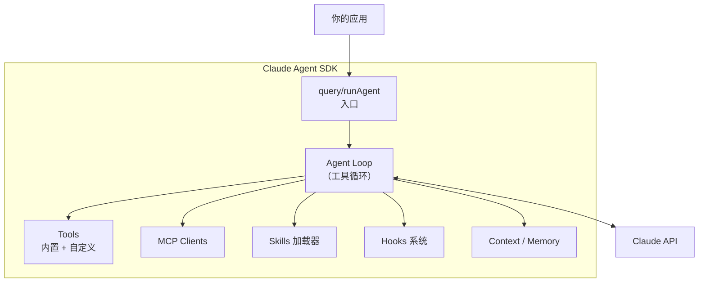
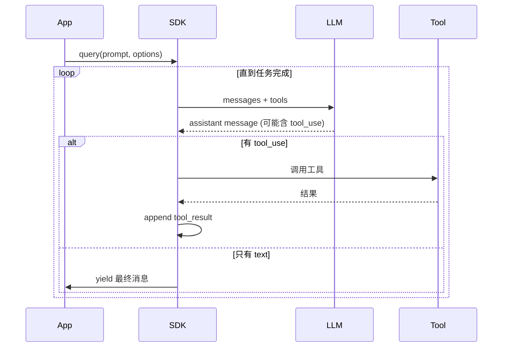

## 什么是 Agent SDK

**Claude Agent SDK** 是 Anthropic 官方提供的一套用来构建"像 Claude Code 一样"的 Agent 程序库。它把 Claude Code 内部的 Agent 循环、工具调度、权限控制、上下文管理等核心能力抽成可编程的 API，让你可以：

- 构建面向特定领域的**专业 Agent**（代码审查 / 数据分析 / 客服）
- 在应用内嵌入**Agent 能力**（CLI / Web / Desktop）
- 通过程序化方式批量运行 Agent 任务
- 与现有后端集成（CI、任务调度、工作流引擎）

<Note>
Agent SDK 目前有 TypeScript 和 Python 两个官方实现，API 基本对齐。下文以 TypeScript 为主，Python 会标注差异。
</Note>

## 能做什么 vs 不能做什么

| 能力 | 说明 |
|------|------|
| ✅ 调用 Claude 模型（含工具使用） | 自动管理 tools 循环 |
| ✅ 接入 MCP servers | 配置即接入，无需手写协议 |
| ✅ 使用 Skills | 自动发现并按需加载 |
| ✅ Subagents 分发子任务 | 原生并发 |
| ✅ Hooks 拦截事件 | 生命周期钩子 |
| ✅ 自定义工具 | 用本地函数扩展能力 |
| ❌ 训练 / 微调模型 | 这是 API 层的事 |
| ❌ 替代 HTTP 直连 | SDK 是 Agent 循环，不是 HTTP 客户端 |

## 安装

```bash
# TypeScript / Node.js
npm install @anthropic-ai/claude-agent-sdk

# Python
pip install claude-agent-sdk
```

环境变量：

```bash
export ANTHROPIC_API_KEY=sk-ant-...
```

## 最小示例

```ts
import { query } from "@anthropic-ai/claude-agent-sdk"

const result = query({
  prompt: "统计当前目录下有多少个 .ts 文件，并列出前 5 个最大的",
  options: {
    model: "claude-sonnet-4-5",
    allowedTools: ["Bash", "Read"],
  },
})

for await (const message of result) {
  if (message.type === "assistant") {
    console.log(message.text)
  }
}
```

只用几行代码，SDK 就帮你完成：

1. 建立与 Claude 的对话
2. 注入默认工具（Bash / Read 等）
3. 驱动 tool-use 循环直到任务完成
4. 以流式方式返回消息

## 核心概念



### Agent Loop

SDK 内部的核心循环：



你不需要自己写循环——`query()` 是个异步迭代器，直接 `for await` 就能拿到流式输出。

## Options 全景

```ts
const options: AgentOptions = {
  // 模型选择
  model: "claude-sonnet-4-5",
  maxTokens: 8192,

  // 工具控制
  allowedTools: ["Bash", "Read", "Write", "Grep"],
  disallowedTools: ["WebFetch"],

  // System Prompt
  systemPrompt: "你是一个严谨的 TypeScript 代码审查员。",
  appendSystemPrompt: "输出使用中文。",

  // 工作目录与权限
  cwd: "/path/to/project",
  permissionMode: "default", // "default" | "acceptEdits" | "bypassPermissions"

  // MCP 集成
  mcpServers: {
    github: {
      command: "npx",
      args: ["-y", "@modelcontextprotocol/server-github"],
      env: { GITHUB_TOKEN: process.env.GH_TOKEN },
    },
  },

  // Hooks
  hooks: {
    PreToolUse: [{ matcher: "Bash", handler: myBashGuard }],
  },

  // 会话
  resume: "session-id-xxx",   // 继续已有会话
  maxTurns: 20,               // 最大对话轮数
}
```

## 自定义工具

除了 SDK 内置工具，你可以注入本地函数：

```ts
import { query, tool } from "@anthropic-ai/claude-agent-sdk"
import { z } from "zod"

const getWeather = tool({
  name: "get_weather",
  description: "Get current weather for a city",
  inputSchema: z.object({
    city: z.string().describe("City name in English"),
  }),
  async execute({ city }) {
    const res = await fetch(`https://api.weather.com/${city}`)
    const data = await res.json()
    return `The weather in ${city} is ${data.temp}°C, ${data.condition}`
  },
})

const result = query({
  prompt: "北京现在天气怎么样？",
  options: {
    tools: [getWeather],
  },
})
```

注意事项：

- **输入用 Zod schema**，SDK 会自动转成 JSON Schema
- **execute 返回字符串**，不要返回复杂对象
- **抛出异常会被捕获**并作为错误反馈给模型
- **工具要幂等**，模型可能重试

## 消息流类型

`query()` 返回的迭代器会 yield 多种消息：

| 类型 | 含义 | 典型用途 |
|------|------|---------|
| `system` | 系统信息（初始化、session） | 记录 session_id |
| `user` | 用户消息 | 回显 |
| `assistant` | 模型回复 | 展示文本 / 检测工具调用 |
| `tool_use` | 工具调用开始 | UI 进度条 |
| `tool_result` | 工具执行结果 | 日志 |
| `result` | 最终总结 | 结束标志、usage 统计 |

处理示例：

```ts
for await (const msg of result) {
  switch (msg.type) {
    case "assistant":
      process.stdout.write(msg.text)
      break
    case "tool_use":
      console.log(`\n[调用工具] ${msg.name}`)
      break
    case "result":
      console.log(`\n总 tokens: ${msg.usage.total_tokens}`)
      break
  }
}
```

## 会话管理

SDK 支持会话持久化，断点续跑：

```ts
// 第一次
const session1 = query({ prompt: "开始分析这个项目" })
let sessionId: string
for await (const msg of session1) {
  if (msg.type === "system" && msg.subtype === "init") {
    sessionId = msg.session_id
  }
}

// 几小时后继续
const session2 = query({
  prompt: "刚才说到哪了？继续",
  options: { resume: sessionId },
})
```

这让你可以：

- 构建可中断/恢复的长任务
- 实现多轮对话的后端接口
- 支持 Agent 后台跑任务 + 异步查看结果

## 权限与安全

SDK 提供三档权限模式：

| 模式 | 行为 |
|------|------|
| `default` | 危险操作需要用户确认 |
| `acceptEdits` | 自动接受文件编辑，其他仍需确认 |
| `bypassPermissions` | 全部自动通过（CI / 沙箱场景） |

程序化控制权限：

```ts
options: {
  canUseTool: async (toolName, input) => {
    if (toolName === "Bash" && input.command.includes("rm -rf")) {
      return { behavior: "deny", message: "禁止危险命令" }
    }
    return { behavior: "allow" }
  }
}
```

这是一个实时判断钩子，每次工具调用前被触发。

## 与 MCP 集成

只需在 options 中配置 MCP servers，SDK 会自动启动进程并注入工具：

```ts
mcpServers: {
  sqlite: {
    command: "npx",
    args: ["-y", "@modelcontextprotocol/server-sqlite", "./data.db"],
  },
  custom: {
    // 或连接远程 HTTP server
    url: "https://mcp.example.com/sse",
    headers: { Authorization: "Bearer ..." },
  },
}
```

服务器暴露的所有 tools 会自动出现在 Agent 可用工具列表里，无需手动桥接。

## 典型应用模式

### 模式 1：一次性任务 Agent

```ts
async function runLintAgent(file: string) {
  const result = query({
    prompt: `Lint ${file} and fix all issues`,
    options: { allowedTools: ["Read", "Edit"], maxTurns: 10 },
  })
  for await (const msg of result) { /* log */ }
}
```

适合 CI、定时任务、批处理。

### 模式 2：交互式聊天

```ts
const session = query({ prompt: initial, options: { ... } })
// 把 session 包装成 WebSocket / SSE 流，传给前端
```

### 模式 3：后台监听 Agent

```ts
for (const event of eventQueue) {
  await query({
    prompt: `处理事件 ${event.id}`,
    options: { resume: agentSessionId },
  })
}
```

一个长生命周期 session，逐条处理事件队列。

### 模式 4：多 Agent 协作

```ts
const plan = await runPlanner(prompt)
const results = await Promise.all(
  plan.tasks.map(task => runWorker(task))
)
await runReducer(results)
```

用 SDK 构建"规划 → 分发 → 汇总"的多 Agent pipeline，每个子 Agent 是独立的 `query()` 调用。

## 性能与成本

| 优化点 | 做法 |
|--------|------|
| 减少 turn 数 | 明确 prompt，设置 `maxTurns` |
| 减小上下文 | 用 `appendSystemPrompt` 替代大段历史 |
| 复用 session | `resume` 续跑，避免重载 context |
| 限制工具 | `allowedTools` 只开必需的 |
| 快路径 | 简单任务用 haiku，复杂用 sonnet/opus |
| 并行子任务 | 拆 subagents 并发执行 |

## 与 Claude Code 的关系

| 项 | Claude Code | Agent SDK |
|----|-------------|-----------|
| 定位 | 终端 IDE 助手 | 通用构建库 |
| UI | 命令行 TUI | 无（由你提供） |
| 配置 | `settings.json` + `.claude/` | 代码 options |
| 工具 | 预置整套 | 按需传入 |
| 权限 | 交互确认 | `canUseTool` 钩子 |

你可以把 Agent SDK 理解成"**去掉 Claude Code 的 UI 后的内核**"。

## 小结

Agent SDK 让"构建自己的 Claude Code"变成几行代码的事：

- **query() 是入口**，异步迭代器吐消息
- **options 控制一切**：模型、工具、权限、MCP、Hooks
- **自定义工具**用 Zod schema + execute 函数
- **会话 resume** 支持长任务
- **canUseTool** 是程序化权限关卡

下一章 [Agent Hooks](/ai/agent/hooks) 介绍如何通过 Hooks 在关键生命周期注入自定义逻辑。
