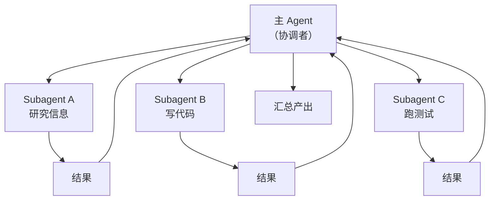
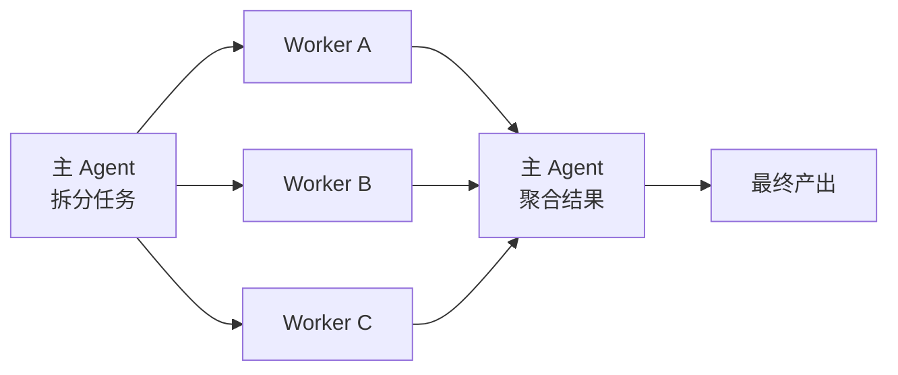

## 什么是 Subagent

**Subagent（子代理）** 是由主 Agent 通过工具调用创建的、拥有独立上下文的子任务 Agent。它的核心特点：

- **独立上下文**：子代理有自己的消息历史，不污染父 Agent
- **任务隔离**：失败/超时影响仅限子代理
- **可并发**：多个 subagent 可并行执行
- **可专业化**：不同 subagent 可配置不同模型、工具、系统提示



## 为什么需要 Subagents

### 问题 1：上下文爆炸

大任务需要读 50 个文件才能给出结论。如果全塞到主 Agent 里：

- 上下文飙升，成本高
- 细节过多容易分散注意力
- 后续轮次被 "历史负担" 拖慢

用 subagent："你去读那 50 个文件，然后告诉我一个总结"——**只把结论带回主 Agent**。

### 问题 2：串行太慢

"收集 A / 收集 B / 收集 C" 三件事如果串行做，每件 20 秒就 1 分钟。并行 subagent 能把时间压到 ~20 秒。

### 问题 3：专业化需求

- "代码审查"需要严格的 instructions
- "写产品文案"需要创意风格
- "执行 Bash 命令"需要受限权限

一个 prompt 很难同时扮演好所有角色。subagent 让每个子任务有自己的"人格"。

## Subagent 的定义方式

主流的两种定义方式：

### 方式 1：配置文件式（Claude Code 风格）

在 `.claude/agents/` 下放 markdown：

```markdown
---
name: code-reviewer
description: >-
  Use this agent to review code for quality, security, and best
  practices. Returns structured feedback with actionable suggestions.
tools: Read, Grep, Glob
model: sonnet
---

You are a senior code reviewer. Focus on:

1. Security vulnerabilities
2. Performance issues
3. Code smells
4. Missing tests

Return your review as a bullet list, grouped by severity.
```

主 Agent 看到合适的任务就通过内置的 `Agent` 工具调用它。

### 方式 2：SDK 动态式

```ts
import { query } from "@anthropic-ai/claude-agent-sdk"

async function codeReviewSubagent(file: string) {
  const result = query({
    prompt: `Review the file at ${file}`,
    options: {
      systemPrompt: "You are a senior code reviewer...",
      allowedTools: ["Read", "Grep"],
      model: "claude-sonnet-4-5",
      maxTurns: 5,
    },
  })

  let review = ""
  for await (const msg of result) {
    if (msg.type === "assistant") review += msg.text
  }
  return review
}
```

本质上，subagent 就是**在主 Agent 的工具调用里启动另一个 Agent query**。

## 通用调用协议

主 Agent 通常通过一个叫 `Agent`（或 `Task`）的内置工具调用子代理：

```json
{
  "tool": "Agent",
  "input": {
    "subagent_type": "code-reviewer",
    "description": "Review auth module",
    "prompt": "Review src/auth/*.ts for security issues"
  }
}
```

- `subagent_type`：指向配置文件中的 name
- `description`：简短说明（用于 UI / 日志）
- `prompt`：完整任务描述

子代理执行完后，**只把最终文本结果**返回给主 Agent——中间过程不可见，避免污染上下文。

## 并发模式

### 顺序（简单但慢）

```ts
const a = await subagent("task-a")
const b = await subagent("task-b")  // 等 a 完成才开始
```

### 并行（推荐）

```ts
const [a, b, c] = await Promise.all([
  subagent("task-a"),
  subagent("task-b"),
  subagent("task-c"),
])
```

在主 Agent 的提示里，这种并发通常通过**一次性发出多个 Agent 工具调用**实现。SDK 和 harness 会自动并行执行。

### Map-Reduce 模式



例子："分析 git log 过去 1 年"：

1. 主 Agent 把 12 个月拆成 12 个 subagent
2. 每个 subagent 独立分析一个月
3. 主 Agent 把 12 份报告合并

上下文从 "12 个月的 commits" 变成 "12 份 1 页的摘要"——**从 O(N) 变成 O(1)**。

## 典型 Subagent 类型

下面是一些值得沉淀的通用 subagent：

| 类型 | 用途 | 关键配置 |
|------|------|---------|
| **research** | 调研信息后给总结 | 开放 WebFetch/Search，low temp |
| **code-reviewer** | 代码审查 | 只给 Read/Grep，严格 prompt |
| **refactor** | 重构代码 | 给 Edit，要求保留测试通过 |
| **test-runner** | 跑测试并分析失败 | Bash + Read |
| **doc-writer** | 生成文档 | 创意风格，高 temp |
| **planner** | 分解任务 | 不给执行工具，只输出 plan |
| **validator** | 验证产物 | Read only，严格判定 |

## 何时该拆 Subagent

### 拆分的信号

✅ 考虑拆分的场景：

- 预计要读取 > 10 个文件
- 子任务需要与主任务**不同的工具集**
- 子任务可以**并行**
- 子任务产出的**中间过程主线不需要**
- 需要**隔离故障**（某一步失败不影响其他）

### 不拆分的信号

❌ 不应拆分：

- 子任务需要高频访问主 Agent 的上下文
- 任务规模小（串行更简单）
- 需要多轮交互才能完成
- 中间状态对主线非常重要

经验法则：**如果"只需要一个最终答案"，就适合拆；如果"需要跟进过程"，就不拆**。

## 传递上下文的技巧

子代理没有父代理的历史，怎么传上下文？

### 技巧 1：在 prompt 里显式传

```ts
const prompt = `
上下文：用户正在开发一个 React 项目，使用 TypeScript + Vite。
当前目录：${cwd}
相关文件：${files.join(', ')}

任务：${actualTask}
`
```

### 技巧 2：通过工作目录 / 文件共享

子代理与父代理共享文件系统。主 Agent 把要共享的信息写入文件，子代理用 Read 读：

```ts
await writeFile(".claude/ctx/current.json", JSON.stringify(context))
// 子代理 prompt："首先读取 .claude/ctx/current.json 了解上下文"
```

### 技巧 3：通过 MCP 资源

让主代理和子代理共用同一组 MCP servers，状态通过 MCP 的 Resources 共享。

## 避坑指南

### 坑 1：嵌套过深

subagent 调用 subagent 调用 subagent 很快就失控。经验：

- 最多 2 层嵌套
- 超过 2 层通常说明任务拆分方式不对

### 坑 2：期望子代理"反馈进度"

子代理只返回**最终结果**。想看过程就不该拆。

### 坑 3：子代理越权

子代理默认继承主代理的部分能力。务必用 `allowedTools` 限制它能做什么，尤其是"只读"任务不要给 Write/Bash。

### 坑 4：并发冲突

多个子代理同时写同一个文件会出竞争。并发任务之间必须是**读-读**或**写-不同目标**。

### 坑 5：上下文过载传递

```ts
// ❌ 把主代理半个对话历史塞进 prompt
const prompt = `上下文：${JSON.stringify(allHistory)}...`

// ✅ 只传必要信息
const prompt = `任务：${task}\n已知关键信息：${summary}`
```

## 监控与调试

### 日志每个 subagent

给每次调用打 trace id：

```ts
const traceId = crypto.randomUUID()
console.log(`[${traceId}] subagent start: ${name}`)
const result = await runSubagent(name, prompt)
console.log(`[${traceId}] subagent done: ${result.length} chars`)
```

### 配合 SubagentStop Hook

利用 Hooks 在 subagent 结束时自动记录：

```json
{
  "hooks": {
    "SubagentStop": [{
      "hooks": [{ "type": "command", "command": "bash .claude/hooks/log-sub.sh" }]
    }]
  }
}
```

### 可观测指标

值得监控：

- 每个 subagent 的 token 消耗
- 每个 subagent 的耗时
- 成功率 / 超时率
- 调用层级分布

## 实战案例：代码仓库分析 Agent

任务：分析一个仓库，产出架构总结、依赖图、风险清单。

```ts
// 1. 主 Agent 分析仓库结构
const files = await query({
  prompt: "列出仓库中所有关键源码目录",
  options: { allowedTools: ["Glob", "Read"] },
})

// 2. 对每个模块并行启动子代理
const analyses = await Promise.all(
  modules.map(m =>
    runSubagent("module-analyzer", `分析模块 ${m}：职责、依赖、风险`)
  )
)

// 3. 安全审计子代理（独立上下文）
const security = await runSubagent(
  "security-auditor",
  "扫描整个仓库的安全问题"
)

// 4. 依赖图子代理
const depGraph = await runSubagent(
  "dep-graph-builder",
  "产出模块依赖 mermaid 图"
)

// 5. 主 Agent 汇总
const finalReport = await query({
  prompt: `基于以下材料产出架构报告：
  模块分析：${analyses.join("\n")}
  安全审计：${security}
  依赖图：${depGraph}`,
})
```

关键点：

- 并行 `Promise.all` 把总时间压缩
- 每个子代理配置不同 system prompt
- 主 Agent 只看"摘要"，上下文很小

## 小结

Subagents 是 Agent 架构的"分治法"：

- **独立上下文**防止爆炸
- **并发**压缩时间
- **专业化**提升质量
- **隔离**提升稳健

记住三条：

1. **只传必要信息，只取最终结果**
2. **严格限制子代理工具集**
3. **不超过 2 层嵌套**

配合前面介绍的 [Agent SDK](/ai/agent/sdk)、[Hooks](/ai/agent/hooks)、[Skills](/ai/skills/introduction)、[MCP](/ai/mcp/introduction)，你就拥有了构建复杂 Agent 系统的全套能力。
