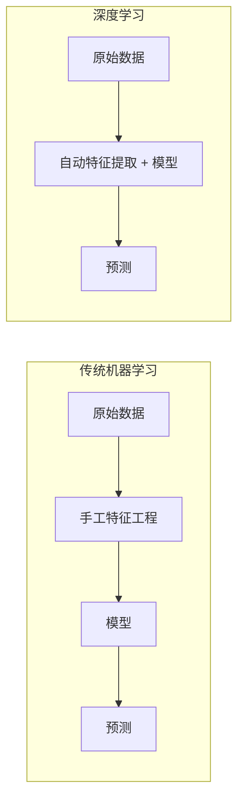
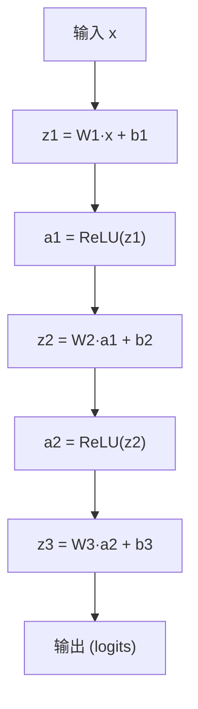

## 什么是深度学习

深度学习（Deep Learning）是机器学习的一个子领域，使用多层神经网络从数据中自动学习分层特征表示。与传统机器学习需要手工设计特征不同，深度学习能够端到端地从原始数据中提取特征。



<Tip>
深度学习中的"深度"指的是神经网络的层数。一般来说，超过 2 个隐藏层的神经网络就可以称为深度神经网络。现代模型如 GPT、ResNet 等可以有数十到数百层。
</Tip>

## 感知机（Perceptron）

感知机是神经网络最基本的组成单元，模拟了生物神经元的工作方式。

### 工作原理

一个感知机接收多个输入，每个输入乘以对应的权重，求和后加上偏置，再通过激活函数得到输出：

$$output = f(w_1 x_1 + w_2 x_2 + ... + w_n x_n + b)$$

其中 `f` 是激活函数，`w` 是权重，`b` 是偏置。

```python
import numpy as np

class Perceptron:
    """一个简单的感知机实现"""
    def __init__(self, input_size, lr=0.01):
        self.weights = np.random.randn(input_size)
        self.bias = 0.0
        self.lr = lr

    def activate(self, x):
        """阶跃激活函数"""
        return 1 if x >= 0 else 0

    def predict(self, x):
        z = np.dot(self.weights, x) + self.bias
        return self.activate(z)

    def train(self, X, y, epochs=100):
        for _ in range(epochs):
            for xi, yi in zip(X, y):
                pred = self.predict(xi)
                error = yi - pred
                self.weights += self.lr * error * xi
                self.bias += self.lr * error
```

<Note>
单层感知机只能解决线性可分问题（如 AND、OR），无法解决异或（XOR）问题。这是促使多层神经网络发展的关键动因。
</Note>

## 激活函数（Activation Functions）

激活函数为神经网络引入非线性，使网络能够学习复杂的模式。没有激活函数，无论多少层的网络都等价于一个线性变换。

### 常用激活函数

| 函数 | 公式 | 输出范围 | 特点 |
|------|------|---------|------|
| Sigmoid | 1 / (1 + e^(-x)) | (0, 1) | 适合二分类输出层，容易梯度消失 |
| Tanh | (e^x - e^(-x)) / (e^x + e^(-x)) | (-1, 1) | 零中心化，但仍有梯度消失 |
| ReLU | max(0, x) | [0, +∞) | 计算简单，最常用，可能导致神经元死亡 |
| Leaky ReLU | max(0.01x, x) | (-∞, +∞) | 解决 ReLU 死亡问题 |
| GELU | x × Φ(x) | (-∞, +∞) | Transformer 模型常用 |
| Softmax | e^(xi) / Σe^(xj) | (0, 1) 且和为1 | 多分类输出层 |

```python
import torch
import torch.nn.functional as F

x = torch.tensor([-2.0, -1.0, 0.0, 1.0, 2.0])

print(f"ReLU:    {F.relu(x)}")
print(f"Sigmoid: {torch.sigmoid(x)}")
print(f"Tanh:    {torch.tanh(x)}")
print(f"GELU:    {F.gelu(x)}")
```

<Tip>
选择激活函数的经验法则：隐藏层优先使用 ReLU 或其变体；二分类输出层用 Sigmoid；多分类输出层用 Softmax；Transformer 架构中常用 GELU。
</Tip>

## 前向传播（Forward Propagation）

前向传播是数据从输入层经过各隐藏层最终到达输出层的过程。每一层对输入执行线性变换后再通过激活函数。

```python
import torch
import torch.nn as nn

class SimpleNetwork(nn.Module):
    def __init__(self):
        super().__init__()
        self.layer1 = nn.Linear(784, 256)   # 输入层 → 隐藏层1
        self.layer2 = nn.Linear(256, 128)    # 隐藏层1 → 隐藏层2
        self.layer3 = nn.Linear(128, 10)     # 隐藏层2 → 输出层

    def forward(self, x):
        """前向传播过程"""
        x = F.relu(self.layer1(x))    # 线性变换 + ReLU
        x = F.relu(self.layer2(x))    # 线性变换 + ReLU
        x = self.layer3(x)            # 输出层（无激活，交给损失函数处理）
        return x

model = SimpleNetwork()
print(f"模型参数量: {sum(p.numel() for p in model.parameters()):,}")
```

前向传播的计算流程：



## 反向传播（Backpropagation）

反向传播是训练神经网络的核心算法。它利用链式法则（Chain Rule），从输出层到输入层逐层计算损失函数对每个参数的梯度，然后用梯度更新参数。

### 核心思想

1. **前向传播**：计算预测值
2. **计算损失**：衡量预测值与真实值的差距
3. **反向传播**：计算每个参数的梯度（偏导数）
4. **更新参数**：沿梯度反方向调整参数

```python
# PyTorch 中的反向传播（自动微分）
model = SimpleNetwork()
criterion = nn.CrossEntropyLoss()
optimizer = torch.optim.Adam(model.parameters(), lr=0.001)

# 模拟一个训练步骤
x = torch.randn(32, 784)    # 一批 32 个样本
y = torch.randint(0, 10, (32,))  # 对应标签

# 1. 前向传播
output = model(x)

# 2. 计算损失
loss = criterion(output, y)

# 3. 反向传播（自动计算梯度）
optimizer.zero_grad()   # 清除旧梯度
loss.backward()         # 计算梯度

# 4. 更新参数
optimizer.step()

print(f"损失值: {loss.item():.4f}")
```

<Warning>
调用 `loss.backward()` 前一定要先调用 `optimizer.zero_grad()` 清除旧梯度。PyTorch 默认会累积梯度，如果不清除，梯度会越来越大，导致训练不稳定。
</Warning>

## 损失函数（Loss Functions）

损失函数衡量模型预测与真实值之间的差距，是优化的目标。

### 常用损失函数

| 损失函数 | 用途 | PyTorch 类 |
|----------|------|-----------|
| 均方误差（MSE） | 回归 | `nn.MSELoss()` |
| 交叉熵（Cross-Entropy） | 多分类 | `nn.CrossEntropyLoss()` |
| 二元交叉熵（BCE） | 二分类 | `nn.BCEWithLogitsLoss()` |
| L1 Loss | 回归（对异常值鲁棒） | `nn.L1Loss()` |
| Huber Loss | 回归（MSE 和 L1 的结合） | `nn.HuberLoss()` |

```python
# 回归任务
mse_loss = nn.MSELoss()
pred = torch.tensor([2.5, 3.0, 4.5])
target = torch.tensor([3.0, 3.0, 5.0])
print(f"MSE Loss: {mse_loss(pred, target):.4f}")

# 多分类任务
ce_loss = nn.CrossEntropyLoss()
logits = torch.tensor([[2.0, 1.0, 0.1]])  # 模型原始输出
label = torch.tensor([0])                  # 真实类别
print(f"Cross-Entropy Loss: {ce_loss(logits, label):.4f}")
```

<Note>
PyTorch 的 `nn.CrossEntropyLoss` 内部已经包含了 Softmax 运算，所以模型输出层不需要再加 Softmax。直接传入原始 logits 即可。
</Note>

## 优化器（Optimizers）

优化器决定了如何根据梯度来更新模型参数。

### SGD（随机梯度下降）

最基础的优化器，每次用一小批数据的梯度来更新参数：

$$w = w - lr \times \nabla L$$

```python
optimizer = torch.optim.SGD(model.parameters(), lr=0.01, momentum=0.9)
```

加入动量（Momentum）后，SGD 会参考历史梯度方向，帮助跳出局部最优并加速收敛。

### Adam（自适应矩估计）

Adam 结合了动量法和自适应学习率，是目前最常用的优化器。它为每个参数维护独立的学习率，自动调整更新步长。

```python
optimizer = torch.optim.Adam(model.parameters(), lr=0.001, betas=(0.9, 0.999))
```

### 优化器对比

| 优化器 | 优点 | 缺点 | 推荐场景 |
|--------|------|------|---------|
| SGD + Momentum | 泛化性好、经典可靠 | 需要仔细调学习率 | CV 任务、追求最佳泛化 |
| Adam | 收敛快、对超参不敏感 | 泛化可能略差 | NLP、快速实验 |
| AdamW | Adam + 权重衰减修正 | - | Transformer 训练标配 |

## Batch 和 Epoch

理解这两个概念对配置训练流程至关重要。

- **Batch Size**：每次参数更新时使用的样本数量
- **Epoch**：整个训练集被遍历一次称为一个 epoch
- **Iteration**：一个 batch 的训练为一次 iteration

```
假设训练集有 10000 个样本，batch_size = 100：
- 每个 epoch 需要 10000 / 100 = 100 次 iteration
- 训练 50 个 epoch，总共需要 5000 次参数更新
```

```python
from torch.utils.data import DataLoader, TensorDataset

# 创建数据加载器
dataset = TensorDataset(torch.randn(10000, 784), torch.randint(0, 10, (10000,)))
dataloader = DataLoader(dataset, batch_size=64, shuffle=True)

# 完整训练循环
model = SimpleNetwork()
criterion = nn.CrossEntropyLoss()
optimizer = torch.optim.Adam(model.parameters(), lr=0.001)

num_epochs = 10
for epoch in range(num_epochs):
    total_loss = 0
    correct = 0
    total = 0

    for batch_x, batch_y in dataloader:
        # 前向传播
        output = model(batch_x)
        loss = criterion(output, batch_y)

        # 反向传播 + 更新
        optimizer.zero_grad()
        loss.backward()
        optimizer.step()

        total_loss += loss.item()
        correct += (output.argmax(dim=1) == batch_y).sum().item()
        total += batch_y.size(0)

    avg_loss = total_loss / len(dataloader)
    accuracy = correct / total
    print(f"Epoch [{epoch+1}/{num_epochs}] Loss: {avg_loss:.4f} Acc: {accuracy:.4f}")
```

<Tip>
Batch Size 的选择影响训练效果：太小会导致训练不稳定，太大会占用过多显存且可能降低泛化能力。常见的取值为 32、64、128、256。建议从 32 或 64 开始尝试。
</Tip>

## 深度学习框架

### PyTorch

由 Meta 开发，以动态计算图和 Pythonic 的 API 著称，是目前学术界和工业界最流行的框架。

```python
import torch
import torch.nn as nn

# 定义模型
class MNISTClassifier(nn.Module):
    def __init__(self):
        super().__init__()
        self.net = nn.Sequential(
            nn.Linear(784, 512),
            nn.ReLU(),
            nn.Dropout(0.2),
            nn.Linear(512, 256),
            nn.ReLU(),
            nn.Dropout(0.2),
            nn.Linear(256, 10)
        )

    def forward(self, x):
        return self.net(x.view(-1, 784))

# 模型摘要
model = MNISTClassifier()
print(model)
```

### TensorFlow / Keras

由 Google 开发，拥有强大的生产部署工具链（TF Serving、TF Lite）。Keras 是其高层 API，上手简单。

```python
import tensorflow as tf
from tensorflow import keras

# 使用 Keras Sequential API 定义相同的模型
model = keras.Sequential([
    keras.layers.Flatten(input_shape=(28, 28)),
    keras.layers.Dense(512, activation='relu'),
    keras.layers.Dropout(0.2),
    keras.layers.Dense(256, activation='relu'),
    keras.layers.Dropout(0.2),
    keras.layers.Dense(10, activation='softmax')
])

model.compile(
    optimizer='adam',
    loss='sparse_categorical_crossentropy',
    metrics=['accuracy']
)

model.summary()
```

### 框架选择建议

| 场景 | 推荐框架 |
|------|---------|
| 学术研究 / 原型开发 | PyTorch |
| 大模型训练（LLM） | PyTorch |
| 移动端 / 嵌入式部署 | TensorFlow Lite |
| 快速上手学习 | PyTorch 或 Keras |

## 完整实战：MNIST 手写数字识别

以下是一个使用 PyTorch 完成手写数字分类的完整示例：

```python
import torch
import torch.nn as nn
import torch.optim as optim
from torchvision import datasets, transforms
from torch.utils.data import DataLoader

# 1. 数据准备
transform = transforms.Compose([
    transforms.ToTensor(),
    transforms.Normalize((0.1307,), (0.3081,))
])

train_dataset = datasets.MNIST('./data', train=True, download=True, transform=transform)
test_dataset = datasets.MNIST('./data', train=False, transform=transform)

train_loader = DataLoader(train_dataset, batch_size=64, shuffle=True)
test_loader = DataLoader(test_dataset, batch_size=1000)

# 2. 定义模型
model = MNISTClassifier()
criterion = nn.CrossEntropyLoss()
optimizer = optim.Adam(model.parameters(), lr=0.001)

# 3. 训练
def train(model, loader, criterion, optimizer, epochs=5):
    model.train()
    for epoch in range(epochs):
        for data, target in loader:
            optimizer.zero_grad()
            output = model(data)
            loss = criterion(output, target)
            loss.backward()
            optimizer.step()
        print(f"Epoch {epoch+1} 完成")

# 4. 评估
def evaluate(model, loader):
    model.eval()
    correct = 0
    with torch.no_grad():
        for data, target in loader:
            output = model(data)
            correct += (output.argmax(dim=1) == target).sum().item()
    accuracy = correct / len(loader.dataset)
    print(f"测试准确率: {accuracy:.4f}")

train(model, train_loader, criterion, optimizer)
evaluate(model, test_loader)
```

## 小结

深度学习的核心要素：

- **模型**：由层（Layer）、激活函数、连接方式组成的网络结构
- **损失函数**：定义优化目标
- **优化器**：决定参数更新策略
- **数据**：通过 DataLoader 组织为 batch 进行训练

掌握了这些基础，你可以进一步学习卷积神经网络（CNN）、循环神经网络（RNN）、注意力机制等更高级的网络架构。
