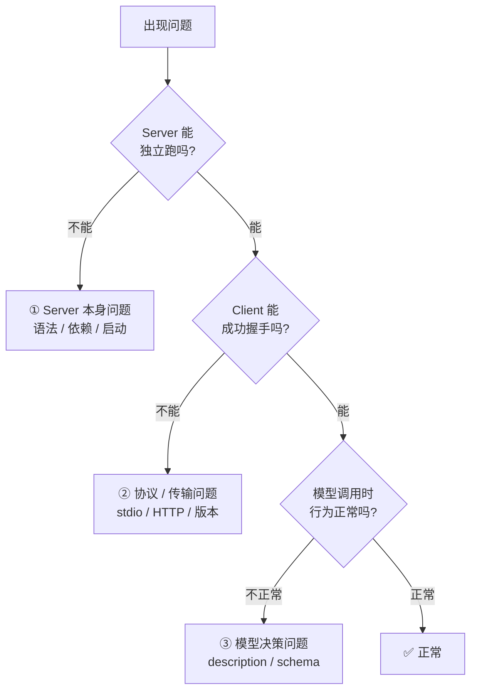

## 调试的三个层次

MCP 出问题时，首先判断症结在哪一层：



自上而下排除，比乱试有效得多。

## 层级一：Server 本身

### 脱离 MCP Client 单独运行

最快的冒烟测试：直接用 stdio 喂 JSON-RPC。

```bash
# 以 Python MCP Server 为例
echo '{"jsonrpc":"2.0","id":1,"method":"initialize","params":{"protocolVersion":"2024-11-05","capabilities":{},"clientInfo":{"name":"test","version":"0.0.1"}}}' \
  | python -m my_server
```

如果这一步都 hang 住或报错，问题在 server 启动逻辑上，跟 MCP 协议无关。

### 看标准错误，不要看标准输出

MCP 的 stdio 传输占用 **stdout**，所有调试日志必须走 **stderr**。

❌ 错误做法：

```python
print(f"received request: {req}")  # 污染了协议流
```

✅ 正确做法：

```python
import sys
print(f"received request: {req}", file=sys.stderr)
# 或
import logging
logging.basicConfig(stream=sys.stderr, level=logging.DEBUG)
```

凡是"client 说收到的响应不是合法 JSON"——90% 是你往 stdout 打了日志。

### 用 Inspector 可视化

官方提供了 `@modelcontextprotocol/inspector`，带 Web UI：

```bash
npx @modelcontextprotocol/inspector python -m my_server
```

它会：

1. 启动你的 server
2. 建立 MCP 连接
3. 打开本地页面，可视化展示 tools / resources / prompts
4. 让你手动调用工具，查看原始请求和响应

**调试期间永远开着它。**

## 层级二：协议与传输

### 协议版本不匹配

Client 握手时会告知 `protocolVersion`，server 必须响应一个自己支持的版本：

```json
// client 请求
{ "protocolVersion": "2024-11-05", ... }

// server 响应
{ "protocolVersion": "2024-11-05", ... }
```

如果 server 回了个别的版本号，client 可能直接断开。检查依赖 SDK 版本是否与 client 匹配。

### stdio 传输最容易踩的坑

| 坑 | 解决办法 |
|----|---------|
| server 进程被 SIGPIPE 干掉 | 捕获 BrokenPipeError |
| 缓冲区没 flush | Python: `sys.stdout.flush()`；Node: `process.stdout.write(..., 'utf-8')` |
| 编码问题 | 强制 UTF-8: `PYTHONIOENCODING=utf-8` |
| Windows 换行符 `\r\n` | 打开 stdout 为 binary 模式 |
| 启动时长太久 | Client 默认超时 ~60s，别在 init 阶段做大量初始化 |

### HTTP / SSE 传输

当 server 切到 HTTP 时，排查重点变成：

- CORS 头是否允许 client 来源
- SSE 连接是否被代理（nginx / cloudflare）断开
- `Accept: text/event-stream` header 是否存在
- `keep-alive` 间隔是否过长导致中间件超时

### 抓包大法

把 client 和 server 中间加一个透明代理记录所有消息：

```bash
# 用 pipeview 看 stdio 双向数据
pv -cN req < /dev/stdin | python -m my_server | pv -cN resp
```

或者在 server 侧写个"全记录"中间件：

```python
async def log_middleware(request, call_next):
    sys.stderr.write(f"<<< {json.dumps(request)}\n")
    resp = await call_next(request)
    sys.stderr.write(f">>> {json.dumps(resp)}\n")
    return resp
```

## 层级三：模型决策

握手正常、工具可手动调通，但模型实际使用时行为诡异——这是**最常见也最难调**的一类问题。

### 症状 1：工具从不被调用

可能原因：

| 原因 | 验证方法 |
|------|---------|
| description 太泛 | 手动在提示里写"请调用 xxx_tool"，看能否强制触发 |
| 与其他工具重名/重叠 | 暂时禁用同类工具，再看能否触发 |
| Schema required 过多 | 减少必填字段 |
| 工具被安全策略静默过滤 | 检查 client 侧允许列表 |

**调试技巧**：给 description 加一句醒目的触发词：

```text
Use when the user asks to "commit", "submit code", "save changes",
"提交代码", or "保存修改".
```

### 症状 2：参数总是错

检查 Schema 质量：

```json
// ❌ 模型无从判断
{ "type": "string" }

// ✅ 给足上下文
{
  "type": "string",
  "description": "Absolute path to the file, starting with /",
  "pattern": "^/.+",
  "examples": ["/tmp/data.csv"]
}
```

在 description 里加**正负例**比只写类型有效得多。

### 症状 3：重复调用同一工具

模型陷入循环通常因为工具返回没有"结束信号"。

❌ 反例：

```json
{ "content": [{ "type": "text", "text": "done" }] }
```

✅ 正例：

```json
{
  "content": [{
    "type": "text",
    "text": "Issue #42 created successfully at https://github.com/foo/bar/issues/42. Next step: the task is complete, no further action needed."
  }]
}
```

明确告诉模型"结束了"，或者"下一步该做什么"。

### 症状 4：调用后直接放弃

模型调一次失败就不再尝试——通常因为报错信息太模糊：

❌：

```json
{ "isError": true, "content": [{ "type": "text", "text": "Error: 400" }] }
```

✅：

```json
{
  "isError": true,
  "content": [{
    "type": "text",
    "text": "参数 title 为空。请提供非空的 issue 标题后重试。"
  }]
}
```

好错误信息 = 一句话说清"错在哪 + 怎么改"。

### 症状 5：调用成功但模型总结错

模型把工具返回的 JSON"幻觉化"——返回数据过大或结构嵌套过深时常见。

解决：

1. **精简返回**：只返回模型真正需要的字段
2. **扁平化**：避免 3 层以上嵌套
3. **加 summary 字段**：前置一段自然语言总结

```json
{
  "content": [{
    "type": "text",
    "text": "共找到 3 个 issue。标题分别是: A、B、C。详细数据见下:\n\n{...json...}"
  }]
}
```

## 日志与追踪

### 结构化日志

```python
import json, sys, time

def log(event, **kwargs):
    entry = { "t": time.time(), "event": event, **kwargs }
    sys.stderr.write(json.dumps(entry) + "\n")

log("tool_call", name="create_issue", args=args)
log("tool_result", name="create_issue", ok=True, duration_ms=123)
```

配合 `jq` 过滤：

```bash
python -m my_server 2> server.log
cat server.log | jq 'select(.event=="tool_call")'
```

### 调用链 ID

给每个 tool call 分配一个 trace_id，方便对应请求/响应/错误：

```python
import uuid
trace = str(uuid.uuid4())[:8]
log("call_start", trace=trace, tool=name)
try:
    ...
    log("call_ok", trace=trace)
except Exception as e:
    log("call_error", trace=trace, error=str(e))
    raise
```

## 测试策略

### 单元测试 Tool 函数

把 MCP 解绑，直接测业务逻辑：

```python
def test_create_issue_validates_owner():
    result = create_issue_impl(owner="", repo="bar", title="x")
    assert result.is_error
    assert "owner" in result.text
```

### 契约测试

用 JSON Schema 验证器确保 server 声明的 inputSchema 真的能反映代码实际接受的参数：

```python
from jsonschema import validate

def test_schema_matches_impl():
    sample = {"owner": "foo", "repo": "bar", "title": "hi"}
    validate(sample, create_issue_tool.inputSchema)  # 不抛异常
    assert create_issue_impl(**sample).ok
```

### 端到端：用 Inspector 脚本化

Inspector 支持命令行模式批量跑 case：

```bash
mcp-inspector run tests/cases.yaml --server "python -m my_server"
```

## 常见错误速查表

| 错误消息 | 原因 | 对策 |
|---------|------|------|
| `JSON parse error at position 0` | stdout 混入非 JSON 日志 | 日志改到 stderr |
| `method not found: tools/list` | Server 未注册 tools capability | 检查 `capabilities.tools = {}` |
| `version mismatch` | 协议版本不匹配 | 升级 SDK |
| `connection closed` | Server 崩溃 / 异常退出 | 看 stderr 堆栈 |
| `request timeout` | 工具执行超过默认超时 | 异步化或拆分任务 |
| `schema validation failed` | 参数不符合 inputSchema | 检查必填字段和类型 |
| `tool not found` | tool 列表缓存未刷新 | 发送 `tools/list_changed` 通知 |

## 检查清单

上线前过一遍：

- [ ] 所有日志走 stderr
- [ ] 所有工具有 description + 参数 description
- [ ] 必填字段最小化
- [ ] 敏感操作加 `destructiveHint`
- [ ] 错误返回都有"怎么修"的提示
- [ ] Server 启动时间 < 5s
- [ ] 针对每个工具写了至少 3 个测试用例
- [ ] 用 Inspector 手动走过一遍
- [ ] 在真实 Agent 上跑过端到端场景

## 小结

MCP 调试的心法：

1. **分层排查**：Server → 协议 → 模型
2. **Log to stderr**，永远不要污染 stdout
3. **Inspector 常开**，可视化快人十倍
4. **错误要会说话**，给模型修复路径
5. **测试到 Tool 粒度**，别只靠端到端

好 Server = 好的错误处理 + 好的 description + 好的日志。三者缺一不可。
