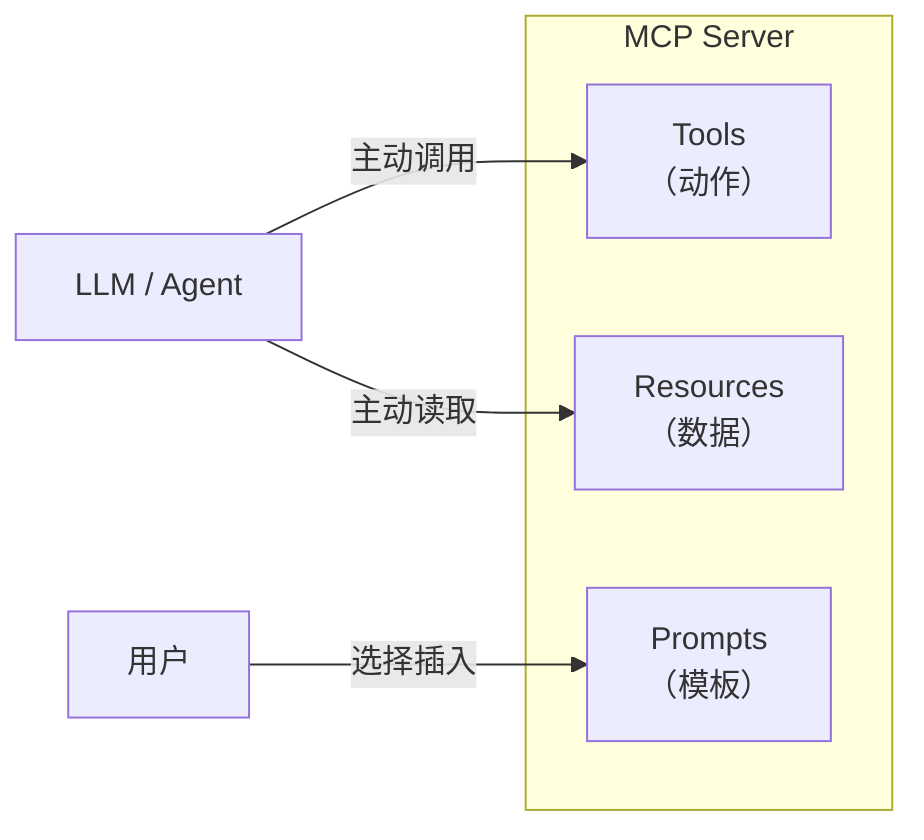
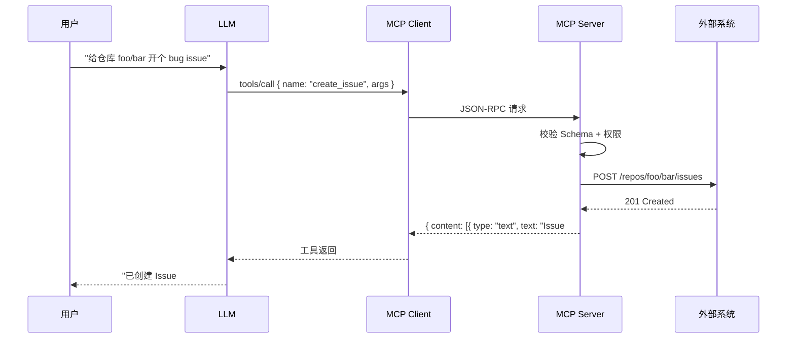

## Tools 在 MCP 三元组中的位置

MCP Server 向外暴露三类能力：

| 能力 | 控制权 | 用途 |
|------|--------|------|
| **Tools** | 模型主动调用 | 执行动作（读写、计算、修改状态） |
| **Resources** | 模型按需读取 | 提供只读上下文（文件、文档、数据） |
| **Prompts** | 用户主动选择 | 预置提示词模板 |



Tools 是三者中最"有副作用"也最强大的一种，本章专注它。

## Tool 的定义结构

一个 MCP Tool 本质上是一段带 JSON Schema 的函数声明：

```json
{
  "name": "create_issue",
  "description": "Create a new issue in the given GitHub repository.",
  "inputSchema": {
    "type": "object",
    "properties": {
      "owner":  { "type": "string", "description": "Repo owner (user or org)" },
      "repo":   { "type": "string", "description": "Repo name" },
      "title":  { "type": "string", "description": "Issue title" },
      "body":   { "type": "string", "description": "Markdown body" },
      "labels": { "type": "array", "items": { "type": "string" } }
    },
    "required": ["owner", "repo", "title"]
  }
}
```

三大字段：

| 字段 | 作用 | 写好的关键 |
|------|------|-----------|
| `name` | 唯一标识 | snake_case、动词开头 |
| `description` | 模型判断用不用的依据 | 写清"做什么、什么时候用、副作用" |
| `inputSchema` | 参数契约 | 加 `description` 字段、合理用 `enum` |

## description：决定命中率

Tool 的 description 是模型调用它的**唯一线索**。好 description 的通用结构：

```text
<动作> <资源>. <触发场景>. <副作用说明>.

Example: Create a new issue in a GitHub repo. Use when the user
asks to file, report, or open an issue. This makes a real API
call and will be visible to other repo collaborators.
```

- **动作+资源**：让模型秒懂功能
- **触发场景**：列出用户的自然语言触发词
- **副作用说明**：警示模型"这是会改变世界的操作"

## inputSchema：契约越严越省心

JSON Schema 支持的特性请尽可能用满：

### 枚举

```json
{
  "priority": {
    "type": "string",
    "enum": ["low", "medium", "high", "urgent"],
    "description": "Issue priority level"
  }
}
```

Agent 看到 enum 会严格约束自己，比在 description 里写"取值必须是 low/medium/..."有效得多。

### 模式正则

```json
{
  "email": {
    "type": "string",
    "pattern": "^[\\w.+-]+@[\\w-]+\\.[\\w.-]+$"
  }
}
```

### 条件与组合

```json
{
  "type": "object",
  "properties": {
    "mode": { "type": "string", "enum": ["fast", "accurate"] },
    "timeout": { "type": "integer" }
  },
  "required": ["mode"],
  "if": { "properties": { "mode": { "const": "accurate" } } },
  "then": { "required": ["timeout"] }
}
```

### 数组元素约束

```json
{
  "tags": {
    "type": "array",
    "items": { "type": "string", "minLength": 1 },
    "minItems": 1,
    "maxItems": 10,
    "uniqueItems": true
  }
}
```

## Tool Annotations

MCP 1.0 引入了 `annotations` 字段，帮助客户端判断工具的"性格"，决定是否需要人工确认：

```json
{
  "name": "delete_file",
  "description": "Delete a file on the filesystem",
  "annotations": {
    "title": "Delete File",
    "readOnlyHint": false,
    "destructiveHint": true,
    "idempotentHint": true,
    "openWorldHint": false
  }
}
```

| Annotation | 含义 | 典型用途 |
|------------|------|---------|
| `title` | 面向用户的友好名称 | UI 显示 |
| `readOnlyHint` | 是否只读 | 只读工具可跳过确认 |
| `destructiveHint` | 是否可能破坏性 | 触发人工确认 |
| `idempotentHint` | 重复调用是否安全 | 失败重试策略 |
| `openWorldHint` | 是否与外部世界交互 | 区分纯计算 vs 联网 |

<Note>
annotations 只是 hint（暗示），不是安全边界。真正的权限控制必须在 server 侧强制。
</Note>

## Tool 的执行流



关键点：

1. Server 必须**再次校验**输入，不能信任 client 传来的参数
2. 返回结构是 `content` 数组，支持多种类型（text / image / resource 引用）
3. 异常通过 `isError: true` 返回，而不是 JSON-RPC error（让模型能看到错误消息并自我修复）

## 返回内容的类型

```json
{
  "content": [
    { "type": "text", "text": "处理完成，共生成 3 个文件" },
    { "type": "image", "data": "<base64>", "mimeType": "image/png" },
    {
      "type": "resource",
      "resource": {
        "uri": "file:///tmp/report.pdf",
        "mimeType": "application/pdf"
      }
    }
  ],
  "isError": false
}
```

**实践建议**：

- 小结构化数据：放在 `text` 里（JSON 字符串）
- 大文件 / 二进制：用 `resource` 引用，让 client 按需读取
- 图片 / 截图：`image` 类型
- 错误信息：设置 `isError: true` 并在 text 里写清楚失败原因

## 设计 Tool 的 8 条原则

### 1. 动词开头，单一动作

```text
✅ create_issue     search_files    send_email
❌ issue            file_helper     email_tool
```

### 2. 粒度适中

太细：每个参数一个工具 → 模型困惑
太粗：一个工具做 10 件事 → 参数爆炸

经验法则：**一个工具对应一个 HTTP API 或一条 CLI 命令**。

### 3. 失败要会说话

```json
{
  "content": [{
    "type": "text",
    "text": "创建失败：仓库 foo/bar 不存在。可用操作：1) 检查仓库名拼写 2) 使用 list_repos 列出可用仓库"
  }],
  "isError": true
}
```

给模型一条**自我修复的路径**，而不是只丢一个 stack trace。

### 4. 副作用显式化

在 description 里明确写：

```text
Side effects: makes a real HTTP POST to GitHub API.
Visible to repo collaborators. Costs 1 API quota.
```

### 5. 幂等优先

能设计成幂等的就别做成一次性的。例如 `upsert_record` 优于 `create_record` + `update_record` 两个工具。

### 6. 参数"扁平优先"

```json
// ❌ 深嵌套让模型难组装
{ "config": { "auth": { "credentials": { "token": "..." } } } }

// ✅ 扁平
{ "token": "..." }
```

### 7. 默认值放 Schema

```json
{
  "timeout": {
    "type": "integer",
    "default": 30,
    "description": "Request timeout in seconds (default 30)"
  }
}
```

避免模型每次都得传所有参数。

### 8. 避免重名歧义

如果同一个会话接入了多个 server，工具名可能冲突。建议用前缀：`github_create_issue` / `jira_create_issue`。

## 权限与安全

Tools 可以改变世界，安全红线必须在 server 侧强制：

```python
@server.tool()
def delete_file(path: str):
    # 1. 路径白名单
    allowed_root = Path("/workspace")
    target = (allowed_root / path).resolve()
    if allowed_root not in target.parents:
        return error("路径越界")

    # 2. 敏感文件保护
    if target.name in {".env", "credentials.json"}:
        return error("禁止删除敏感文件")

    # 3. 需要人工确认的操作
    if target.stat().st_size > 100 * 1024 * 1024:
        return error("文件过大，请先人工确认")

    target.unlink()
    return ok(f"已删除 {path}")
```

**永远不要**依赖模型"自律"——模型会被 prompt 注入。所有限制必须是 server 侧的硬规则。

## 动态工具列表

Server 可以根据用户身份、时间、环境动态返回 tools 列表：

```python
@server.list_tools()
async def list_tools(ctx):
    tools = [base_tools]
    if ctx.user.is_admin:
        tools.extend(admin_only_tools)
    if feature_flag("beta"):
        tools.append(experimental_tool)
    return tools
```

Client 会在 `tools/list_changed` 通知后重新拉取，实现热更新。

## 调试技巧

| 症状 | 可能原因 |
|------|---------|
| 工具从不被调用 | description 太泛 / 与其他工具重复 |
| 参数错乱 | Schema 缺 description 或 enum |
| 模型重复调用同一工具 | 返回内容没有明确"下一步"提示 |
| 模型放弃工具改为纯推理 | 工具报错信息不清晰 |

更多排查技巧见 [MCP 调试](/ai/mcp/debugging)。

## 小结

Tools 是 MCP 里最"实干"的能力：

- **description + Schema 是契约**，写得细=模型用得对
- **annotations 是暗示**，权限还得 server 硬控
- **返回要给出下一步**，帮模型自我修复
- **幂等 + 扁平 + 动词命名** 是长期友好的设计

下一章 [MCP 调试](/ai/mcp/debugging) 将介绍如何定位 Server 在真实 Agent 场景下出现的各类问题。
