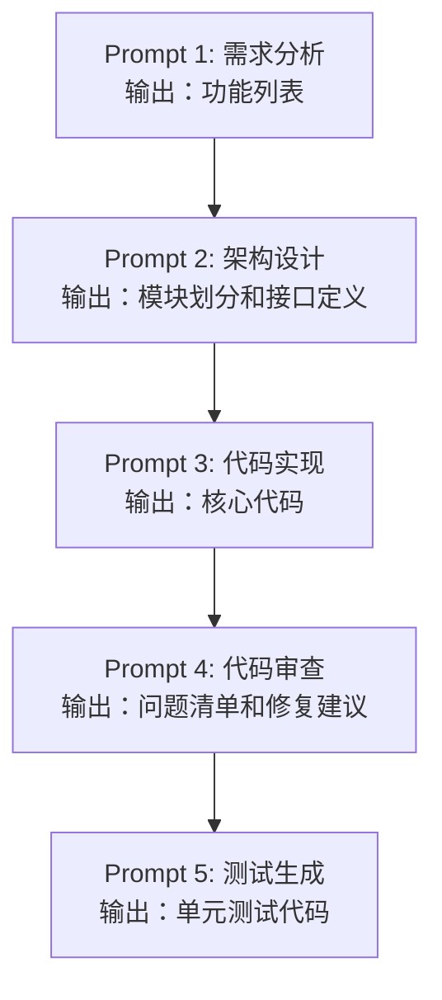

## 概述

在掌握了 Prompt 的基本结构之后，进一步学习具体的提示词技巧可以帮助你应对更复杂的任务。本文将介绍几种经过验证的、在实际开发中高频使用的提示词技巧，并通过对比帮助你选择合适的策略。

## Few-shot Prompting（少样本提示）

Few-shot 是最直观的提示词技巧之一：通过提供少量输入-输出示例，让模型"学会"你期望的模式。

### 基本用法

```text
将以下 Go 函数签名转换为对应的接口定义。

示例 1：
输入：func GetUser(id int) (*User, error)
输出：
type UserGetter interface {
    GetUser(id int) (*User, error)
}

示例 2：
输入：func SaveOrder(order *Order) error
输出：
type OrderSaver interface {
    SaveOrder(order *Order) error
}

请转换：
输入：func DeleteComment(postID, commentID int) error
```

### Few-shot 的关键要点

**示例的质量比数量更重要。** 以下是编写高质量示例的原则：

| 原则 | 说明 | 示例 |
|------|------|------|
| 代表性 | 示例应覆盖不同的典型情况 | 包含有参数和无参数的函数 |
| 一致性 | 所有示例格式必须统一 | 输入/输出格式完全相同 |
| 边界性 | 包含一个边界情况的示例 | 包含错误处理或空值的情况 |
| 简洁性 | 示例不宜过于复杂 | 避免嵌套过深的示例 |

### 带标签的 Few-shot

为示例添加标签可以让模式更加明确：

```text
任务：为 Go 代码生成单行注释摘要。

[代码]
func (s *Server) Shutdown(ctx context.Context) error {
    s.mu.Lock()
    defer s.mu.Unlock()
    s.closed = true
    return s.listener.Close()
}
[摘要] 安全关闭服务器：加锁后标记关闭状态并关闭监听器。

[代码]
func retry(fn func() error, maxRetries int, delay time.Duration) error {
    var err error
    for i := 0; i < maxRetries; i++ {
        if err = fn(); err == nil {
            return nil
        }
        time.Sleep(delay)
    }
    return fmt.Errorf("after %d retries: %w", maxRetries, err)
}
[摘要] 带延迟的重试机制：执行函数最多 maxRetries 次，每次失败后等待 delay。

[代码]
func (c *Cache) Get(key string) (interface{}, bool) {
    c.mu.RLock()
    defer c.mu.RUnlock()
    if item, ok := c.items[key]; ok && !item.IsExpired() {
        return item.Value, true
    }
    return nil, false
}
[摘要]
```

<Tip>
当你发现模型无法仅通过文字描述理解你的需求时，Few-shot 是最简单有效的解决方案。2-3 个精心设计的示例胜过长段的文字说明。
</Tip>

## Chain-of-Thought（链式思维）

Chain-of-Thought（CoT）是一种引导模型进行逐步推理的技巧。对于需要逻辑推理、数学计算或多步分析的任务，CoT 可以显著提升准确率。

### 基本 CoT：添加"让我们逐步思考"

最简单的 CoT 方式是在 Prompt 末尾添加引导语：

```text
以下 Go 代码存在一个并发 bug，请找出问题所在。
让我们逐步分析：

func counter() int {
    count := 0
    var wg sync.WaitGroup
    for i := 0; i < 1000; i++ {
        wg.Add(1)
        go func() {
            defer wg.Done()
            count++
        }()
    }
    wg.Wait()
    return count
}
```

模型会被引导进行如下推理：

```text
让我们逐步分析这段代码：

1. 首先看整体结构：启动了 1000 个 goroutine，每个对 count 执行 +1 操作
2. count 是一个共享变量，多个 goroutine 同时读写
3. count++ 不是原子操作，它包含 读取 -> 加1 -> 写入 三个步骤
4. 多个 goroutine 可能同时读取相同的值，导致写入被覆盖
5. 结论：这是一个典型的数据竞争（data race）问题

修复方案：使用 sync/atomic 包或 sync.Mutex 保护共享变量。
```

### 结构化 CoT

对于更复杂的任务，可以预定义推理步骤：

```text
请诊断以下 Go 微服务的性能瓶颈，按以下步骤分析：

步骤 1 - 识别热点：找出代码中可能成为瓶颈的操作
步骤 2 - 评估影响：分析每个热点对整体性能的影响程度
步骤 3 - 根因分析：找出导致瓶颈的根本原因
步骤 4 - 优化方案：针对每个问题提出具体的优化措施
步骤 5 - 优先级排序：按投入产出比排列优化任务

代码如下：
...
```

### Few-shot CoT

将 Few-shot 与 CoT 结合，通过示例展示期望的推理过程：

```text
分析 Go 代码的时间复杂度。

示例：
代码：
func twoSum(nums []int, target int) []int {
    m := make(map[int]int)
    for i, v := range nums {
        if j, ok := m[target-v]; ok {
            return []int{j, i}
        }
        m[v] = i
    }
    return nil
}

分析过程：
1. 外层 for 循环遍历 nums 数组，执行 n 次
2. 循环内的 map 查找操作 m[target-v] 平均时间复杂度 O(1)
3. map 写入操作 m[v] = i 平均时间复杂度 O(1)
4. 没有嵌套循环
结论：时间复杂度 O(n)，空间复杂度 O(n)

请分析以下代码：
func findDuplicates(nums []int) []int {
    sort.Ints(nums)
    var result []int
    for i := 1; i < len(nums); i++ {
        if nums[i] == nums[i-1] {
            result = append(result, nums[i])
        }
    }
    return result
}
```

<Note>
CoT 特别适合以下类型的任务：代码调试、算法分析、系统设计评审、性能诊断。对于简单的任务（如格式转换、翻译），CoT 反而可能降低效率。
</Note>

## 逐步推理（Step-by-step Reasoning）

逐步推理是 CoT 的一种更严格的变体，它要求模型在每一步都给出明确的中间结果。

```text
请逐步执行以下代码审查，每一步给出具体发现：

审查代码：[粘贴代码]

Step 1: 安全性检查
- 检查项：SQL 注入、XSS、敏感信息泄露
- 发现：[列出具体问题]

Step 2: 错误处理检查
- 检查项：未处理的 error、panic 风险
- 发现：[列出具体问题]

Step 3: 并发安全检查
- 检查项：数据竞争、死锁风险、goroutine 泄露
- 发现：[列出具体问题]

Step 4: 性能检查
- 检查项：不必要的内存分配、N+1 查询、未使用缓存
- 发现：[列出具体问题]

Step 5: 总结
- 严重问题：[列表]
- 建议改进：[列表]
- 优先级排序：[按严重程度排序]
```

## ReAct 模式（Reasoning + Acting）

ReAct 模式结合了推理（Reasoning）和行动（Acting），让模型在解决问题时交替进行思考和操作。这种模式在需要模型与外部工具交互的场景中特别有效。

### ReAct 的基本结构

```text
你是一个 DevOps 助手，可以使用以下工具：
- search_logs(keyword): 搜索服务日志
- get_metrics(service, timerange): 获取服务监控指标
- run_query(sql): 执行数据库查询

问题：生产环境的订单服务响应时间突然增加到 5 秒以上，请排查原因。

请按以下格式回答：
Thought: 思考下一步应该做什么
Action: 使用哪个工具，传入什么参数
Observation: 工具返回的结果
...（重复以上过程直到找到答案）
Answer: 最终的结论和建议
```

### ReAct 执行过程示例

```text
Thought: 响应时间突增，首先应该查看是否有错误日志
Action: search_logs("order-service ERROR last 1h")
Observation: 发现大量 "connection timeout to mysql-primary" 错误

Thought: 数据库连接超时，需要确认数据库的状态
Action: get_metrics("mysql-primary", "last 2h")
Observation: CPU 使用率 95%，活跃连接数 500（上限 500）

Thought: 数据库连接池已满且 CPU 过高，可能存在慢查询
Action: run_query("SELECT * FROM slow_log WHERE start_time > NOW() - INTERVAL 1 HOUR ORDER BY query_time DESC LIMIT 5")
Observation: 发现一个全表扫描查询，执行时间 45 秒，每分钟调用 200 次

Answer: 根本原因是一个缺少索引的全表扫描查询，它占满了数据库连接池并导致 CPU 过载。
建议：
1. 立即：为该查询涉及的 WHERE 条件字段添加索引
2. 短期：增加连接池上限至 800 并设置查询超时
3. 长期：启用慢查询监控报警
```

<Warning>
ReAct 模式需要模型支持函数调用（Function Calling）或工具使用才能真正执行。在纯文本对话中，ReAct 只能作为思维框架模拟执行过程。
</Warning>

## Self-Consistency（自洽性）

Self-Consistency 技巧让模型对同一问题生成多条推理路径，然后取最一致的答案。在实际使用中，你可以通过提示词来模拟这个过程。

```text
请用三种不同的分析角度评估以下数据库 Schema 设计是否合理：

Schema:
CREATE TABLE orders (
    id BIGINT PRIMARY KEY,
    user_id BIGINT,
    product_data JSON,
    created_at TIMESTAMP
);

分析角度 1 - 范式化视角：
[从数据库范式的角度分析]

分析角度 2 - 查询性能视角：
[从查询效率和索引的角度分析]

分析角度 3 - 业务扩展视角：
[从未来业务需求变化的角度分析]

综合结论：
[综合三个角度，给出最终建议]
```

<Tip>
Self-Consistency 可以通过 API 的 `temperature` 参数配合实现：设置较高的 temperature 生成多个回答，然后取最一致的结果。这在需要高可靠性的场景中非常有用。
</Tip>

## Prompt Chaining（提示词链）

Prompt Chaining 将复杂任务分解为多个串联的 Prompt，每一步的输出作为下一步的输入。

### 典型的链式流程



### 实际示例

**第一步：分析需求**

```text
分析以下需求并输出结构化的功能清单：

需求：实现一个 Go 语言的 rate limiter（限流器），支持令牌桶和滑动窗口两种算法，
提供 HTTP 中间件接口，支持按 IP 和按 API Key 限流。

请输出 JSON 格式的功能清单，包含功能名、描述、优先级。
```

**第二步：基于上一步输出进行设计**

```text
基于以下功能清单，设计 Go 语言的包结构和核心接口：

[粘贴第一步的输出]

要求：
- 遵循 Go 语言惯例的项目布局
- 核心逻辑与 HTTP 层解耦
- 接口设计支持未来扩展新的限流算法
```

## 分隔符的使用

合理使用分隔符可以让 Prompt 的结构更加清晰，减少模型的理解歧义。

### 常用分隔符对比

| 分隔符 | 适用场景 | 示例 |
|-------|---------|------|
| `"""` 三引号 | 包裹大段文本 | `"""待翻译文本"""` |
| `---` 分割线 | 分隔不同部分 | 示例之间的分隔 |
| `<tag>` XML 标签 | 结构化数据标注 | `<code>...</code>` |
| `` ``` `` 代码块 | 包裹代码片段 | 标准 Markdown 代码块 |
| `###` 标题标记 | 标识各段落主题 | `### 任务描述` |

```text
请将 <source> 中的代码从 Python 重写为 Go，参考 <style> 中的代码风格。

<source>
def fibonacci(n):
    if n <= 1:
        return n
    return fibonacci(n-1) + fibonacci(n-2)
</source>

<style>
// 使用迭代而非递归
// 变量命名使用驼峰式
// 添加输入验证
// 使用 error 返回错误而非 panic
</style>
```

## 否定提示（Negative Prompting）

否定提示是指明确告知模型**不应该做什么**。虽然正向指令通常更有效，但在某些场景中否定提示是有益的补充。

### 有效的否定提示用法

```text
为初学者解释 Go 的 channel 机制。

要求：
- 使用生活中的类比来解释概念
- 提供可运行的示例代码

限制：
- 不要提及底层实现（hchan 结构体、sudog 等）
- 不要涉及 select 语句（这是后续章节的内容）
- 不要使用超过 20 行的代码示例
```

<Note>
否定提示最佳的使用场景是划定内容边界——告诉模型哪些内容超出了当前讨论的范围，避免它过度展开。
</Note>

## 技巧对比与选择指南

| 技巧 | 最佳场景 | 复杂度 | Token 消耗 |
|------|---------|--------|-----------|
| Few-shot | 格式/风格统一 | 低 | 中 |
| CoT | 推理/分析任务 | 中 | 中 |
| ReAct | 工具交互/排查 | 高 | 高 |
| Self-Consistency | 高可靠性决策 | 中 | 高 |
| Prompt Chaining | 复杂多步任务 | 高 | 分步消耗 |
| 否定提示 | 限定范围 | 低 | 低 |

选择技巧时的决策思路：

1. **任务是否需要特定格式？** 是 → Few-shot
2. **任务是否需要推理？** 是 → CoT
3. **任务是否涉及外部工具？** 是 → ReAct
4. **结果是否需要高可靠性？** 是 → Self-Consistency
5. **任务是否可分解为多步？** 是 → Prompt Chaining

<Tip>
这些技巧并非互斥。在实际应用中，经常需要组合使用。例如，Few-shot CoT（用示例展示推理过程）、Prompt Chaining + CoT（每一步都使用链式思维）等组合都非常常见。
</Tip>

## 小结

本文介绍的提示词技巧覆盖了绝大多数实际开发场景。关键在于理解每种技巧的适用条件，而不是机械地套用模板。随着实践经验的积累，你会逐渐形成自己的技巧组合策略，高效地完成各类任务。
