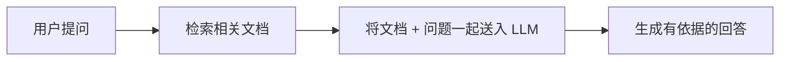
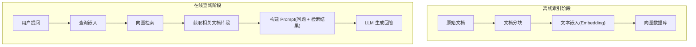
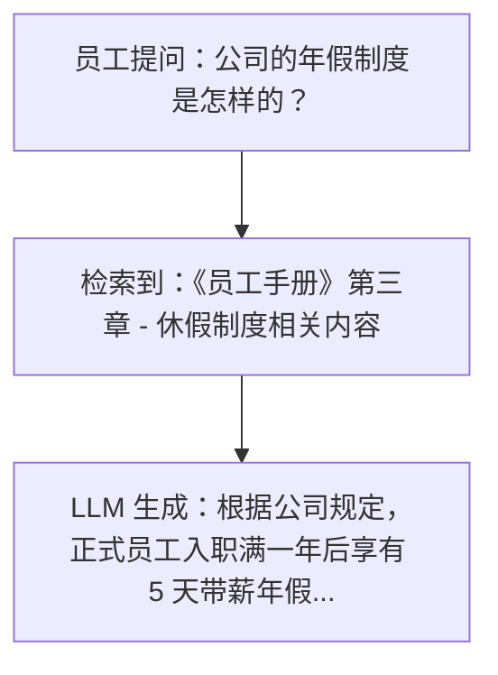

## 什么是 RAG

RAG（Retrieval-Augmented Generation，检索增强生成）是一种将**信息检索**与**大语言模型生成**相结合的技术架构。其核心思想是：在大语言模型（LLM）生成回答之前，先从外部知识库中检索相关信息，将检索到的内容作为上下文提供给模型，从而生成更准确、更有依据的回答。

RAG 最早由 Facebook AI Research（现 Meta AI）在 2020 年的论文 *"Retrieval-Augmented Generation for Knowledge-Intensive NLP Tasks"* 中正式提出，随后迅速成为大语言模型应用中最重要的架构模式之一。



<Tip>
简单来说，RAG 就像是给大语言模型配了一个"开卷考试"的能力——模型不再仅凭记忆回答问题，而是可以翻阅参考资料后再作答。
</Tip>

## 为什么需要 RAG

大语言模型虽然强大，但存在几个关键问题，RAG 正是为了解决这些问题而诞生的。

### 幻觉问题（Hallucination）

LLM 在生成文本时，可能会"编造"看似合理但实际错误的信息。这种现象被称为**幻觉**。例如，模型可能会虚构不存在的论文、编造错误的统计数据，或者给出过时的技术方案。

RAG 通过提供真实的参考文档，有效降低了幻觉的发生概率，使模型的回答有据可查。

### 知识截止问题（Knowledge Cutoff）

LLM 的训练数据有时间截止点，无法获知训练之后发生的事件或产生的新知识。例如，一个训练截止到 2024 年的模型，无法回答 2025 年发布的新技术细节。

RAG 允许系统接入实时更新的外部知识库，从而突破了模型的知识时间限制。

### 领域知识不足

通用大模型对特定领域（如企业内部文档、行业规范、专业数据库）的知识覆盖有限。RAG 可以将这些领域专属数据作为检索源，使模型具备专业领域能力。

### 数据隐私与安全

企业的私有数据不适合直接用于模型训练。RAG 架构允许在不修改模型参数的前提下，安全地利用私有数据来增强回答质量。

## RAG 架构概览

一个完整的 RAG 系统通常由三个核心阶段组成：**索引（Indexing）**、**检索（Retrieval）** 和 **生成（Generation）**。

### 整体工作流程



### 索引阶段（Indexing）

索引阶段是离线的数据预处理过程，主要步骤包括：

1. **文档加载**：从各种数据源（PDF、网页、数据库、Markdown 等）加载原始文档
2. **文档分块（Chunking）**：将长文档切分为较小的文本片段，便于后续检索
3. **文本嵌入（Embedding）**：使用嵌入模型将文本片段转换为高维向量表示
4. **向量存储**：将向量及其对应的原始文本存入向量数据库

### 检索阶段（Retrieval）

当用户提出问题时，系统执行以下检索流程：

1. **查询嵌入**：将用户的问题文本转换为向量
2. **相似度搜索**：在向量数据库中查找与查询向量最相似的文档片段
3. **结果排序**：按相似度得分对检索结果进行排序，返回 Top-K 个最相关的片段

### 生成阶段（Generation）

将检索到的文档片段与用户问题组合成完整的 Prompt，发送给大语言模型生成最终回答：

```python
prompt = f"""基于以下参考信息回答用户的问题。
如果参考信息中没有相关内容，请如实告知。

参考信息：
{retrieved_documents}

用户问题：{user_query}

请给出详细的回答："""
```

## RAG vs 微调（Fine-tuning）

RAG 和微调是增强大语言模型能力的两种主要方式，它们各有优劣：

| 对比维度 | RAG | 微调（Fine-tuning） |
|---------|-----|-------------------|
| **知识更新** | 实时更新，只需更新知识库 | 需要重新训练模型 |
| **实现成本** | 较低，无需 GPU 训练资源 | 较高，需要大量计算资源 |
| **数据需求** | 无需标注数据，原始文档即可 | 需要高质量的标注训练数据 |
| **可解释性** | 强，可以追溯信息来源 | 弱，知识隐含在模型参数中 |
| **幻觉控制** | 较好，回答基于检索文档 | 一般，仍可能产生幻觉 |
| **领域适应** | 适合知识密集型任务 | 适合风格/格式/行为调整 |
| **部署复杂度** | 需要维护向量数据库等基础设施 | 模型部署即可 |
| **延迟** | 检索过程增加一定延迟 | 无额外延迟 |

<Note>
在实际项目中，RAG 和微调并非互斥。很多高级应用会同时使用两者——先微调模型以适应特定领域的语言风格，再通过 RAG 注入最新的领域知识。
</Note>

## 典型应用场景

### 企业知识库问答

将企业内部的文档、Wiki、规章制度等构建为知识库，员工可以通过自然语言提问获取准确答案。这是目前 RAG 最常见的应用场景。



### 智能客服系统

基于产品文档、FAQ 和历史工单构建 RAG 系统，自动回答客户的技术问题和业务咨询，显著降低人工客服压力。

### 文档问答与分析

对法律合同、学术论文、技术文档等进行智能问答和信息提取，帮助用户快速定位关键信息。

### 代码助手

检索代码仓库、API 文档和技术规范，帮助开发者快速理解代码逻辑、生成符合项目规范的代码。

### 教育与培训

基于教材和课程资料构建智能辅导系统，为学生提供个性化的学习指导和答疑服务。

### 医疗健康咨询

检索医学文献、临床指南和药品说明书，辅助医生和患者获取准确的医学信息。

<Warning>
医疗、法律等高风险领域的 RAG 应用必须经过严格的验证和审核，不能完全依赖 AI 生成的结果进行决策。
</Warning>

## RAG 的演进方向

### Naive RAG（基础 RAG）

最基本的 RAG 实现，包含简单的索引-检索-生成流程。虽然实现简单，但在复杂场景下可能面临检索质量不佳、上下文窗口有限等问题。

### Advanced RAG（进阶 RAG）

在基础 RAG 的基础上引入多种优化技术：

- **查询改写（Query Rewriting）**：对用户原始查询进行改写或扩展，提高检索质量
- **重排序（Reranking）**：对初步检索结果使用交叉编码器进行精排
- **混合检索（Hybrid Search）**：结合向量检索与关键词检索的优势
- **句子窗口检索**：检索命中片段的同时扩展返回其上下文窗口

### Modular RAG（模块化 RAG）

将 RAG 系统拆分为可灵活组合的独立模块，支持根据不同场景定制检索和生成策略。模块化设计使得系统更易于扩展和维护。

### Agentic RAG（智能体 RAG）

结合 AI Agent 能力，使 RAG 系统具备自主决策能力——能够判断何时需要检索、从哪里检索、是否需要多轮检索等，实现更智能的信息获取和问题解答。

## 小结

RAG 是当前大语言模型应用中最实用、最广泛采用的技术架构之一。它以较低的成本解决了 LLM 的幻觉问题和知识时效性问题，为企业和开发者提供了一条快速构建智能问答系统的路径。

在后续章节中，我们将深入探讨 RAG 系统的核心组件——向量数据库、文本嵌入模型，并通过完整的实战案例带你构建自己的 RAG 应用。
