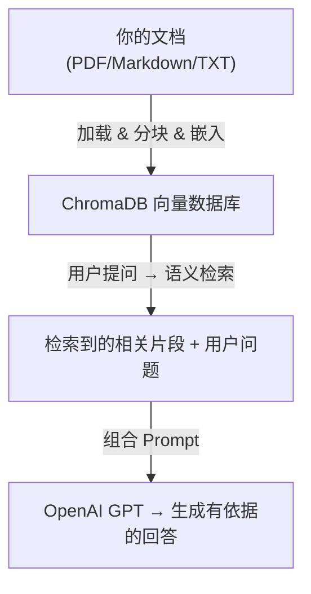

## 实战目标

本章将带你从零构建一个完整的 RAG 文档问答系统。我们将使用以下技术栈：

- **LangChain**：RAG 应用开发框架
- **ChromaDB**：向量数据库
- **OpenAI**：嵌入模型 + 大语言模型

最终实现的效果：用户可以上传自己的文档（PDF、Markdown 等），然后通过自然语言提问获取基于文档内容的准确回答。



## 环境准备

### 安装依赖

```bash
pip install langchain langchain-openai langchain-chroma langchain-community
pip install chromadb
pip install pypdf     # PDF 文档加载
pip install unstructured  # 多格式文档加载（可选）
```

### 配置 API Key

```python
import os
os.environ["OPENAI_API_KEY"] = "sk-your-api-key"

# 如果使用国内代理
# os.environ["OPENAI_API_BASE"] = "https://your-proxy.com/v1"
```

<Warning>
请勿将 API Key 硬编码在代码中并提交到版本控制系统。建议使用环境变量或 `.env` 文件管理密钥，并将 `.env` 加入 `.gitignore`。
</Warning>

## 第一步：文档加载

LangChain 提供了丰富的文档加载器（Document Loaders），支持多种文档格式。

### 加载 PDF 文档

```python
from langchain_community.document_loaders import PyPDFLoader

# 加载单个 PDF 文件
loader = PyPDFLoader("./docs/technical_guide.pdf")
documents = loader.load()

print(f"加载了 {len(documents)} 页文档")
print(f"第一页内容预览: {documents[0].page_content[:200]}")
print(f"元数据: {documents[0].metadata}")
# 输出: {'source': './docs/technical_guide.pdf', 'page': 0}
```

### 加载 Markdown 文档

```python
from langchain_community.document_loaders import UnstructuredMarkdownLoader

loader = UnstructuredMarkdownLoader("./docs/readme.md")
documents = loader.load()
```

### 批量加载目录下的文件

```python
from langchain_community.document_loaders import DirectoryLoader, PyPDFLoader

# 加载目录下所有 PDF 文件
loader = DirectoryLoader(
    "./docs/",
    glob="**/*.pdf",
    loader_cls=PyPDFLoader,
    show_progress=True
)
documents = loader.load()
print(f"共加载 {len(documents)} 个文档片段")
```

### 加载网页内容

```python
from langchain_community.document_loaders import WebBaseLoader

loader = WebBaseLoader("https://docs.example.com/guide")
documents = loader.load()
```

<Tip>
在实际项目中，你可能需要加载多种格式的文档。建议封装一个统一的文档加载函数，根据文件扩展名自动选择对应的加载器。
</Tip>

## 第二步：文本分割

将加载的文档切分为适合检索的小块。

### 使用递归字符分割器

`RecursiveCharacterTextSplitter` 是 LangChain 中最推荐的通用文本分割器，它会按照一系列分隔符（如段落、句子、词）递归地分割文本，尽量保持语义完整性。

```python
from langchain.text_splitter import RecursiveCharacterTextSplitter

text_splitter = RecursiveCharacterTextSplitter(
    chunk_size=500,       # 每个分块的最大字符数
    chunk_overlap=100,    # 相邻分块的重叠字符数
    length_function=len,
    separators=["\n\n", "\n", "。", "！", "？", ".", " ", ""]  # 分隔符优先级
)

chunks = text_splitter.split_documents(documents)
print(f"文档被分成了 {len(chunks)} 个片段")
print(f"第一个片段长度: {len(chunks[0].page_content)} 字符")
print(f"第一个片段内容: {chunks[0].page_content[:100]}...")
```

### 使用 Markdown 专用分割器

如果你的文档是 Markdown 格式，可以使用按标题层级分割的分割器：

```python
from langchain.text_splitter import MarkdownHeaderTextSplitter

headers_to_split_on = [
    ("#", "Header 1"),
    ("##", "Header 2"),
    ("###", "Header 3"),
]

md_splitter = MarkdownHeaderTextSplitter(headers_to_split_on=headers_to_split_on)

md_text = """
# Kubernetes 入门

## 什么是 Kubernetes
Kubernetes 是一个开源的容器编排平台...

## 核心概念
### Pod
Pod 是 Kubernetes 中最小的可部署单元...

### Service
Service 定义了一组 Pod 的访问策略...
"""

md_chunks = md_splitter.split_text(md_text)
for chunk in md_chunks:
    print(f"标题: {chunk.metadata} | 内容: {chunk.page_content[:50]}...")
```

## 第三步：嵌入与向量存储

将文本片段转换为向量并存入 ChromaDB。

```python
from langchain_openai import OpenAIEmbeddings
from langchain_chroma import Chroma

# 初始化嵌入模型
embeddings = OpenAIEmbeddings(
    model="text-embedding-3-small",
    # dimensions=512  # 可选：降维以减少存储空间
)

# 创建向量存储（内存模式，适合测试）
vectorstore = Chroma.from_documents(
    documents=chunks,
    embedding=embeddings,
    collection_name="my_knowledge_base"
)

print(f"已存储 {vectorstore._collection.count()} 个向量")
```

### 持久化存储

```python
# 持久化到磁盘（适合生产使用）
vectorstore = Chroma.from_documents(
    documents=chunks,
    embedding=embeddings,
    persist_directory="./chroma_db",  # 存储路径
    collection_name="my_knowledge_base"
)

# 后续使用时，直接从磁盘加载
vectorstore = Chroma(
    persist_directory="./chroma_db",
    embedding_function=embeddings,
    collection_name="my_knowledge_base"
)
```

### 测试检索

```python
# 测试相似度搜索
query = "Kubernetes 的核心概念有哪些？"
results = vectorstore.similarity_search(query, k=3)

print(f"查询: {query}\n")
for i, doc in enumerate(results):
    print(f"--- 结果 {i+1} ---")
    print(f"来源: {doc.metadata.get('source', 'unknown')}")
    print(f"内容: {doc.page_content[:200]}")
    print()
```

## 第四步：构建检索链

将检索器与大语言模型组合，构建完整的 RAG 问答链。

### 基础问答链

```python
from langchain_openai import ChatOpenAI
from langchain.chains import RetrievalQA
from langchain.prompts import PromptTemplate

# 初始化 LLM
llm = ChatOpenAI(
    model="gpt-4o-mini",
    temperature=0  # 降低随机性，使回答更稳定
)

# 自定义 Prompt 模板
prompt_template = PromptTemplate(
    input_variables=["context", "question"],
    template="""你是一个专业的技术文档助手。请基于以下参考信息回答用户的问题。

要求：
1. 只基于提供的参考信息回答，不要编造信息
2. 如果参考信息中没有相关内容，请明确告知用户
3. 回答要准确、条理清晰
4. 适当引用原文内容

参考信息：
{context}

用户问题：{question}

请回答："""
)

# 创建检索器
retriever = vectorstore.as_retriever(
    search_type="similarity",   # 相似度搜索
    search_kwargs={"k": 4}      # 返回 top-4 个结果
)

# 创建 RAG 链
qa_chain = RetrievalQA.from_chain_type(
    llm=llm,
    chain_type="stuff",  # 将所有检索结果拼接到 prompt 中
    retriever=retriever,
    chain_type_kwargs={"prompt": prompt_template},
    return_source_documents=True  # 返回源文档
)

# 提问
response = qa_chain.invoke({"query": "Kubernetes 中 Pod 和 Service 的区别是什么？"})
print("回答:", response["result"])
print("\n参考文档:")
for doc in response["source_documents"]:
    print(f"  - {doc.metadata.get('source', 'unknown')}")
```

### 使用 LCEL（LangChain Expression Language）

LangChain 的新版推荐使用 LCEL 方式构建链，更加灵活：

```python
from langchain_openai import ChatOpenAI
from langchain_core.prompts import ChatPromptTemplate
from langchain_core.runnables import RunnablePassthrough
from langchain_core.output_parsers import StrOutputParser

# 定义 Prompt
prompt = ChatPromptTemplate.from_template("""基于以下参考信息回答问题。
如果无法从参考信息中找到答案，请说明。

参考信息：
{context}

问题：{question}

回答：""")

# 辅助函数：格式化检索结果
def format_docs(docs):
    return "\n\n".join(doc.page_content for doc in docs)

# 使用 LCEL 构建 RAG 链
rag_chain = (
    {
        "context": retriever | format_docs,
        "question": RunnablePassthrough()
    }
    | prompt
    | llm
    | StrOutputParser()
)

# 调用
answer = rag_chain.invoke("如何创建一个 Kubernetes Deployment？")
print(answer)
```

### 支持对话历史

```python
from langchain.chains import ConversationalRetrievalChain
from langchain.memory import ConversationBufferMemory

memory = ConversationBufferMemory(
    memory_key="chat_history",
    return_messages=True,
    output_key="answer"
)

conv_chain = ConversationalRetrievalChain.from_llm(
    llm=llm,
    retriever=retriever,
    memory=memory,
    return_source_documents=True
)

# 多轮对话
response1 = conv_chain.invoke({"question": "什么是 Pod？"})
print("回答1:", response1["answer"])

response2 = conv_chain.invoke({"question": "它和 Deployment 有什么关系？"})
print("回答2:", response2["answer"])  # 能理解"它"指的是 Pod
```

## 完整示例代码

以下是一个完整的、可直接运行的 RAG 系统实现：

```python
"""
完整的 RAG 文档问答系统
使用 LangChain + ChromaDB + OpenAI
"""
import os
from langchain_community.document_loaders import PyPDFLoader, DirectoryLoader
from langchain.text_splitter import RecursiveCharacterTextSplitter
from langchain_openai import OpenAIEmbeddings, ChatOpenAI
from langchain_chroma import Chroma
from langchain_core.prompts import ChatPromptTemplate
from langchain_core.runnables import RunnablePassthrough
from langchain_core.output_parsers import StrOutputParser

# ===== 配置 =====
os.environ["OPENAI_API_KEY"] = "sk-your-api-key"
DOCS_DIR = "./docs"
CHROMA_DIR = "./chroma_db"
COLLECTION_NAME = "knowledge_base"

# ===== 1. 文档加载 =====
def load_documents(docs_dir: str):
    """加载目录下的所有 PDF 文档"""
    loader = DirectoryLoader(
        docs_dir,
        glob="**/*.pdf",
        loader_cls=PyPDFLoader,
        show_progress=True
    )
    return loader.load()

# ===== 2. 文本分割 =====
def split_documents(documents):
    """将文档分割为小块"""
    splitter = RecursiveCharacterTextSplitter(
        chunk_size=500,
        chunk_overlap=100,
        separators=["\n\n", "\n", "。", "！", "？", ".", " ", ""]
    )
    return splitter.split_documents(documents)

# ===== 3. 向量存储 =====
def create_vectorstore(chunks, persist_dir: str):
    """创建并持久化向量存储"""
    embeddings = OpenAIEmbeddings(model="text-embedding-3-small")
    vectorstore = Chroma.from_documents(
        documents=chunks,
        embedding=embeddings,
        persist_directory=persist_dir,
        collection_name=COLLECTION_NAME
    )
    return vectorstore

def load_vectorstore(persist_dir: str):
    """加载已有的向量存储"""
    embeddings = OpenAIEmbeddings(model="text-embedding-3-small")
    return Chroma(
        persist_directory=persist_dir,
        embedding_function=embeddings,
        collection_name=COLLECTION_NAME
    )

# ===== 4. RAG 链 =====
def create_rag_chain(vectorstore):
    """创建 RAG 问答链"""
    retriever = vectorstore.as_retriever(
        search_type="similarity",
        search_kwargs={"k": 4}
    )

    llm = ChatOpenAI(model="gpt-4o-mini", temperature=0)

    prompt = ChatPromptTemplate.from_template(
        """你是一个专业的技术文档助手。请基于以下参考信息回答用户的问题。

要求：
1. 只基于提供的参考信息回答，不要编造信息
2. 如果参考信息不足以回答问题，请明确告知
3. 回答要准确、有条理

参考信息：
{context}

用户问题：{question}

请回答："""
    )

    def format_docs(docs):
        return "\n\n---\n\n".join(doc.page_content for doc in docs)

    chain = (
        {"context": retriever | format_docs, "question": RunnablePassthrough()}
        | prompt
        | llm
        | StrOutputParser()
    )
    return chain

# ===== 主流程 =====
def build_knowledge_base():
    """构建知识库（首次运行）"""
    print("正在加载文档...")
    documents = load_documents(DOCS_DIR)
    print(f"加载了 {len(documents)} 个文档片段")

    print("正在分割文本...")
    chunks = split_documents(documents)
    print(f"分割为 {len(chunks)} 个文本块")

    print("正在创建向量存储...")
    vectorstore = create_vectorstore(chunks, CHROMA_DIR)
    print(f"向量存储创建完成，共 {vectorstore._collection.count()} 条记录")
    return vectorstore

def chat():
    """交互式问答"""
    print("正在加载知识库...")
    vectorstore = load_vectorstore(CHROMA_DIR)
    chain = create_rag_chain(vectorstore)

    print("知识库已就绪！输入问题开始对话（输入 'quit' 退出）\n")
    while True:
        question = input("你: ").strip()
        if question.lower() in ("quit", "exit", "q"):
            break
        if not question:
            continue

        answer = chain.invoke(question)
        print(f"\n助手: {answer}\n")

if __name__ == "__main__":
    import sys
    if len(sys.argv) > 1 and sys.argv[1] == "build":
        build_knowledge_base()
    else:
        chat()
```

使用方式：

```bash
# 首次运行：构建知识库
python rag_app.py build

# 后续运行：交互式问答
python rag_app.py
```

## 优化技巧

基础 RAG 系统搭建完成后，可以通过以下技术进一步提升效果。

### 重排序（Reranking）

初步检索返回的 Top-K 结果中，排序可能不够精确。使用交叉编码器（Cross-Encoder）对结果进行重排序，可以显著提高相关性。

```python
from langchain.retrievers import ContextualCompressionRetriever
from langchain.retrievers.document_compressors import CrossEncoderReranker
from langchain_community.cross_encoders import HuggingFaceCrossEncoder

# 加载重排序模型
cross_encoder = HuggingFaceCrossEncoder(model_name="BAAI/bge-reranker-base")
compressor = CrossEncoderReranker(model=cross_encoder, top_n=3)

# 创建带重排序的检索器
reranking_retriever = ContextualCompressionRetriever(
    base_compressor=compressor,
    base_retriever=vectorstore.as_retriever(search_kwargs={"k": 10})
)

# 先检索 10 条，再用 reranker 精排出 top 3
results = reranking_retriever.invoke("如何优化 Docker 镜像大小？")
```

<Tip>
重排序是提升 RAG 检索质量最有效的方法之一。建议在基础检索阶段多召回一些结果（如 k=10~20），然后通过 Reranker 精选出最相关的 3~5 条。
</Tip>

### 混合检索（Hybrid Search）

结合向量语义检索和关键词检索（BM25）的优势，提高检索的覆盖面和准确性。

```python
from langchain.retrievers import EnsembleRetriever
from langchain_community.retrievers import BM25Retriever

# BM25 关键词检索器
bm25_retriever = BM25Retriever.from_documents(chunks)
bm25_retriever.k = 5

# 向量检索器
vector_retriever = vectorstore.as_retriever(search_kwargs={"k": 5})

# 混合检索（各占 50% 权重）
hybrid_retriever = EnsembleRetriever(
    retrievers=[bm25_retriever, vector_retriever],
    weights=[0.4, 0.6]  # BM25 权重 40%，向量检索权重 60%
)

results = hybrid_retriever.invoke("Redis 分布式锁的实现原理")
```

### 查询转换（Query Transformation）

用户的原始查询可能表述不清或过于简略，通过 LLM 对查询进行改写，可以提高检索效果。

```python
from langchain_core.prompts import ChatPromptTemplate
from langchain_openai import ChatOpenAI

# 查询改写
rewrite_prompt = ChatPromptTemplate.from_template(
    """你是一个查询优化助手。请将用户的问题改写为更适合搜索的形式。
要求：保持原意，扩展关键词，消除歧义。

原始问题：{question}

改写后的问题："""
)

query_rewriter = rewrite_prompt | ChatOpenAI(model="gpt-4o-mini") | StrOutputParser()

# 多查询生成：从不同角度生成多个查询
multi_query_prompt = ChatPromptTemplate.from_template(
    """请从不同角度为以下问题生成 3 个替代查询，每行一个。

原始问题：{question}

替代查询："""
)
```

### 父文档检索（Parent Document Retriever）

用小块进行检索（提高匹配精度），但返回其所在的大块（提供更完整的上下文）。

```python
from langchain.retrievers import ParentDocumentRetriever
from langchain.storage import InMemoryStore

# 小块用于检索，大块用于返回
child_splitter = RecursiveCharacterTextSplitter(chunk_size=200)
parent_splitter = RecursiveCharacterTextSplitter(chunk_size=1000)

store = InMemoryStore()

parent_retriever = ParentDocumentRetriever(
    vectorstore=vectorstore,
    docstore=store,
    child_splitter=child_splitter,
    parent_splitter=parent_splitter,
)

# 添加文档
parent_retriever.add_documents(documents)

# 检索时返回的是包含匹配小块的完整大块
results = parent_retriever.invoke("什么是容器编排？")
```

## 评估方法

RAG 系统的效果评估是保证质量的关键环节。

### 评估维度

| 评估维度 | 说明 | 衡量指标 |
|---------|------|---------|
| **检索质量** | 检索到的文档是否与问题相关 | 召回率、精确率、MRR |
| **生成质量** | 生成的回答是否准确、完整 | 忠实度、相关性、完整性 |
| **端到端效果** | 最终回答是否满足用户需求 | 用户满意度、正确率 |

### 使用 RAGAS 评估

RAGAS 是专门用于 RAG 系统评估的开源框架：

```python
# pip install ragas
from ragas import evaluate
from ragas.metrics import (
    faithfulness,        # 忠实度：回答是否忠于检索到的文档
    answer_relevancy,    # 相关性：回答是否与问题相关
    context_precision,   # 上下文精确率：检索结果是否精准
    context_recall,      # 上下文召回率：是否检索到了所有相关信息
)
from datasets import Dataset

# 准备评估数据
eval_data = {
    "question": ["什么是 Kubernetes？", "Docker 和虚拟机的区别？"],
    "answer": ["Kubernetes 是一个容器编排平台...", "Docker 使用容器技术..."],
    "contexts": [
        ["Kubernetes 是一个开源的容器编排系统..."],
        ["Docker 是一个容器化平台，与传统虚拟机不同..."],
    ],
    "ground_truth": [
        "Kubernetes 是一个开源的容器编排平台，用于自动化部署和管理容器化应用",
        "Docker 使用容器技术共享宿主机内核，而虚拟机使用 Hypervisor 模拟完整操作系统",
    ],
}

dataset = Dataset.from_dict(eval_data)

# 运行评估
result = evaluate(
    dataset,
    metrics=[faithfulness, answer_relevancy, context_precision, context_recall],
)
print(result)
```

### 简单的人工评估方法

在项目初期，可以采用简单的人工评估方式：

1. **准备测试集**：收集 20~50 个代表性问题和标准答案
2. **运行系统**：对每个问题获取 RAG 系统的回答和检索结果
3. **评分**：人工对回答的准确性、完整性、可读性进行 1~5 分评分
4. **分析**：找出低分案例，分析是检索问题还是生成问题，有针对性地优化

<Note>
RAG 系统的优化是一个持续迭代的过程。建议建立一套固定的评估基准（Benchmark），每次修改后都运行评估，确保改动确实提升了效果。
</Note>

## 常见问题排查

| 问题现象 | 可能原因 | 解决方案 |
|---------|---------|---------|
| 检索结果与问题无关 | 分块太大或太小 | 调整 chunk_size，尝试 200~800 |
| 回答包含编造内容 | Prompt 约束不足 | 强化 Prompt 中"不要编造"的指令 |
| 回答不完整 | 检索数量太少 | 增加 k 值，如从 3 提升到 5~8 |
| 回答内容重复 | 检索结果重复 | 增加 chunk_overlap 或使用 MMR 检索 |
| 响应速度慢 | 嵌入/LLM 调用慢 | 使用更小的模型、添加缓存、批量处理 |
| 中文效果差 | 嵌入模型中文能力弱 | 换用 BGE 等中文优化模型 |

## 小结

通过本章的实战练习，你已经掌握了构建 RAG 系统的完整流程：从文档加载、文本分割、向量嵌入存储，到检索链构建和效果优化。RAG 技术的核心在于**检索质量**——好的分块策略、合适的嵌入模型和有效的检索优化（重排序、混合检索等），是构建高质量 RAG 应用的关键。

建议在实际项目中，从最简单的基础 RAG 开始，通过评估发现问题，再逐步引入高级优化手段。
