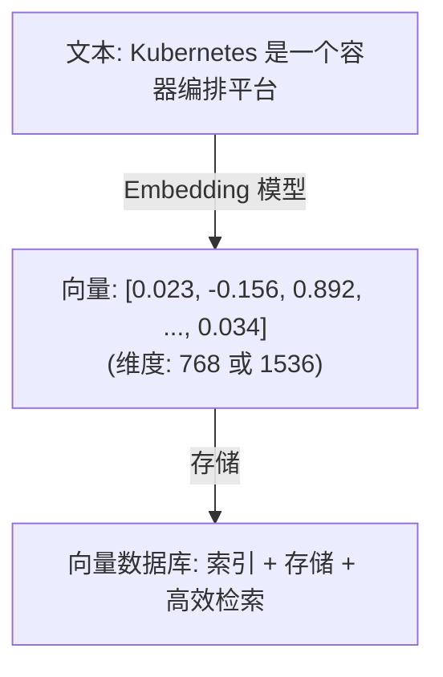

## 什么是向量数据库

向量数据库（Vector Database）是一种专门用于**存储、索引和查询高维向量数据**的数据库系统。与传统关系型数据库存储结构化数据不同，向量数据库以向量（即一组浮点数数组）作为核心数据类型，支持高效的**近似最近邻搜索（ANN, Approximate Nearest Neighbor）**。

在 RAG 系统中，文本经过嵌入模型转换为向量后，需要一个高效的存储和检索系统来管理这些向量——这正是向量数据库的核心作用。



## 为什么 RAG 需要向量数据库

### 语义检索的需求

传统的关键词检索（如 Elasticsearch 的 BM25）基于词频匹配，无法理解语义相似性。例如，用户搜索"如何部署容器应用"，关键词检索可能无法匹配到包含"Docker 镜像发布"的文档，但这两者在语义上是高度相关的。

向量数据库通过在向量空间中计算距离，实现**语义级别**的相似度匹配，这是 RAG 系统检索质量的基础。

### 高效的大规模检索

在实际应用中，知识库可能包含数百万甚至数十亿条文档片段。向量数据库通过专门的索引结构，能够在毫秒级别完成大规模向量集合中的相似度搜索。

### 元数据过滤

除了向量检索，向量数据库还支持基于元数据（如文档来源、时间戳、类别标签等）的过滤，使检索结果更加精准。

## 相似度计算方法

向量之间的相似度计算是向量数据库的核心操作。常用的计算方法有以下三种：

### 余弦相似度（Cosine Similarity）

计算两个向量之间夹角的余弦值，取值范围为 `[-1, 1]`，值越大表示越相似。余弦相似度只关注向量的方向，不受向量长度（模）的影响。

```python
import numpy as np

def cosine_similarity(a, b):
    return np.dot(a, b) / (np.linalg.norm(a) * np.linalg.norm(b))

# 示例
vec_a = np.array([1.0, 2.0, 3.0])
vec_b = np.array([2.0, 4.0, 6.0])
print(cosine_similarity(vec_a, vec_b))  # 输出: 1.0（方向完全相同）
```

<Tip>
余弦相似度是 RAG 系统中最常用的相似度度量方式，因为嵌入模型生成的向量通常已经进行了归一化处理，使用余弦相似度能够很好地衡量语义相似性。
</Tip>

### 欧氏距离（Euclidean Distance / L2）

计算两个向量在空间中的直线距离，值越小表示越相似。欧氏距离同时考虑了向量的方向和大小。

```python
def euclidean_distance(a, b):
    return np.linalg.norm(a - b)

vec_a = np.array([1.0, 2.0, 3.0])
vec_b = np.array([4.0, 5.0, 6.0])
print(euclidean_distance(vec_a, vec_b))  # 输出: 5.196
```

### 点积（Dot Product / Inner Product）

计算两个向量的内积，值越大表示越相似。当向量已归一化时，点积等价于余弦相似度。

```python
def dot_product(a, b):
    return np.dot(a, b)

vec_a = np.array([1.0, 2.0, 3.0])
vec_b = np.array([2.0, 4.0, 6.0])
print(dot_product(vec_a, vec_b))  # 输出: 28.0
```

### 三种方法对比

| 度量方法 | 取值范围 | 相似度判断 | 适用场景 |
|---------|---------|----------|---------|
| 余弦相似度 | [-1, 1] | 值越大越相似 | 归一化向量、文本语义匹配 |
| 欧氏距离 | [0, +∞) | 值越小越相似 | 图像特征、地理位置数据 |
| 点积 | (-∞, +∞) | 值越大越相似 | 归一化向量、推荐系统 |

## 主流向量数据库对比

| 特性 | Milvus | Pinecone | Chroma | Weaviate | Qdrant | FAISS |
|------|--------|----------|--------|----------|--------|-------|
| **类型** | 开源 | 云服务 | 开源 | 开源 | 开源 | 开源库 |
| **开发语言** | Go/C++ | - | Python | Go | Rust | C++ |
| **部署方式** | 自托管/云 | 仅云端 | 嵌入式/服务端 | 自托管/云 | 自托管/云 | 嵌入式 |
| **分布式支持** | 支持 | 内置 | 不支持 | 支持 | 支持 | 不支持 |
| **最大数据规模** | 十亿级 | 十亿级 | 百万级 | 十亿级 | 十亿级 | 十亿级 |
| **混合检索** | 支持 | 支持 | 有限 | 支持 | 支持 | 不支持 |
| **元数据过滤** | 支持 | 支持 | 支持 | 支持 | 支持 | 有限 |
| **学习曲线** | 中等 | 低 | 低 | 中等 | 中等 | 高 |
| **适用场景** | 大规模生产 | 快速上线 | 原型开发 | 语义搜索 | 高性能检索 | 研究/嵌入 |

### Milvus

Milvus 是由 Zilliz 公司开源的向量数据库，采用存算分离架构，支持十亿级向量的高效检索。它是目前功能最完善的开源向量数据库之一，适合大规模生产环境。

### Pinecone

Pinecone 是一个全托管的云向量数据库服务，无需运维，开箱即用。适合不想自建基础设施、希望快速上线的团队。

### Chroma

Chroma 是一个轻量级的开源向量数据库，支持嵌入式部署（直接在 Python 进程中运行），非常适合原型开发和小规模应用。

### Weaviate

Weaviate 是一个支持多模态数据的开源向量数据库，内置了文本和图像的向量化模块，支持 GraphQL 查询接口。

### Qdrant

Qdrant 使用 Rust 编写，以高性能和低资源消耗著称。支持丰富的过滤条件和负载（payload）管理。

### FAISS

FAISS（Facebook AI Similarity Search）是 Meta 开源的向量相似度搜索库。严格来说它不是一个完整的数据库，而是一个高性能的索引和搜索库，常被其他系统集成使用。

<Note>
对于学习和原型开发，推荐从 **Chroma** 入手，它的 API 简洁，部署方便，零配置即可运行。当项目进入生产阶段并需要处理大规模数据时，可以考虑迁移到 Milvus 或 Qdrant。
</Note>

## Chroma 快速入门

以下示例展示如何使用 Chroma 构建一个简单的向量检索系统。

### 安装

```bash
pip install chromadb
```

### 基本使用

```python
import chromadb

# 创建 Chroma 客户端（内存模式）
client = chromadb.Client()

# 创建一个集合（Collection），类似于数据库中的表
collection = client.create_collection(
    name="my_knowledge_base",
    metadata={"hnsw:space": "cosine"}  # 使用余弦相似度
)

# 添加文档（Chroma 内置了默认的嵌入模型）
collection.add(
    documents=[
        "Docker 是一个开源的容器化平台，用于构建、发布和运行应用",
        "Kubernetes 是一个容器编排系统，用于自动化部署和管理容器化应用",
        "Nginx 是一个高性能的 HTTP 服务器和反向代理服务器",
        "Redis 是一个开源的内存数据结构存储系统，可用作数据库和缓存",
        "MySQL 是最流行的开源关系型数据库管理系统",
    ],
    ids=["doc1", "doc2", "doc3", "doc4", "doc5"],
    metadatas=[
        {"category": "container"},
        {"category": "container"},
        {"category": "web"},
        {"category": "database"},
        {"category": "database"},
    ]
)

# 查询相似文档
results = collection.query(
    query_texts=["如何部署容器应用？"],
    n_results=3  # 返回最相似的 3 条
)

print("查询结果：")
for i, doc in enumerate(results["documents"][0]):
    distance = results["distances"][0][i]
    print(f"  [{i+1}] (距离: {distance:.4f}) {doc}")
```

### 使用自定义嵌入模型

```python
import chromadb
from chromadb.utils import embedding_functions

# 使用 OpenAI 嵌入模型
openai_ef = embedding_functions.OpenAIEmbeddingFunction(
    api_key="your-api-key",
    model_name="text-embedding-3-small"
)

# 创建集合时指定嵌入函数
collection = client.create_collection(
    name="openai_collection",
    embedding_function=openai_ef
)
```

### 持久化存储

```python
# 使用持久化客户端，数据保存到磁盘
client = chromadb.PersistentClient(path="./chroma_db")

# 之后的操作与内存模式相同
collection = client.get_or_create_collection("my_collection")
```

### 带元数据过滤的查询

```python
# 只在 category 为 "database" 的文档中检索
results = collection.query(
    query_texts=["高性能缓存方案"],
    n_results=2,
    where={"category": "database"}  # 元数据过滤
)
```

## 索引策略

向量数据库的检索性能很大程度上取决于底层的索引算法。以下是两种最常用的索引策略：

### HNSW（Hierarchical Navigable Small World）

HNSW 是目前最流行的 ANN 索引算法，基于分层的小世界图结构。它通过在多层图中进行贪心搜索来快速找到近似最近邻。

**优点：**
- 查询速度快，召回率高
- 支持增量插入，无需重建索引
- 内存中运行，延迟极低

**缺点：**
- 内存占用较大（需要存储图结构）
- 构建索引速度较慢

**适用场景：** 数据规模在百万到千万级，对查询延迟要求高的场景。Chroma、Qdrant 等默认使用 HNSW 索引。

### IVF（Inverted File Index）

IVF 先将向量空间划分为多个聚类（通过 K-Means），查询时只在最相近的几个聚类中搜索，从而减少比较次数。

**优点：**
- 内存占用相对较小
- 适合超大规模数据集
- 可与量化（PQ）结合进一步压缩

**缺点：**
- 需要预先训练聚类中心
- 不支持增量更新，新增数据需要重建索引

**适用场景：** 数据规模在十亿级以上，可以接受略低召回率的场景。FAISS 中大量使用 IVF 系列索引。

### 索引选择建议

| 数据规模 | 推荐索引 | 说明 |
|---------|---------|------|
| < 10 万 | Flat（暴力搜索） | 数据量小，暴力搜索即可满足需求 |
| 10 万 ~ 1000 万 | HNSW | 平衡查询速度和召回率 |
| > 1000 万 | IVF + PQ | 大规模数据需要压缩和分区 |

## 实践建议

### 向量维度选择

向量维度直接影响存储空间和检索性能。常见的维度选择：

- **384 维**：轻量级模型（如 `all-MiniLM-L6-v2`），适合资源受限场景
- **768 维**：中等规模模型（如 BGE-base），性能与效率的平衡点
- **1536 维**：OpenAI `text-embedding-3-small`，高质量通用嵌入
- **3072 维**：OpenAI `text-embedding-3-large`，最高质量但资源消耗大

<Tip>
OpenAI 的 `text-embedding-3` 系列模型支持通过 `dimensions` 参数动态降维，可以在不更换模型的前提下灵活调整维度。
</Tip>

### 批量操作

向量数据库的写入和查询通常支持批量操作，批量处理比逐条处理的效率高出数倍。建议每批处理 100~1000 条数据。

### 数据备份与恢复

生产环境中必须定期备份向量数据库。大多数向量数据库支持快照（Snapshot）功能，建议设置自动定时备份。

### 监控指标

部署向量数据库后，需要关注以下关键指标：

- **查询延迟（P95/P99）**：端到端的查询响应时间
- **召回率（Recall）**：检索结果与真实最近邻的重合程度
- **内存使用**：索引和数据的内存占用
- **QPS**：每秒查询数，衡量系统吞吐能力

<Warning>
向量数据库的内存使用量与数据规模和向量维度成正比。在规划服务器资源时，请确保预留充足的内存空间。一个粗略的估算公式：内存 ≈ 向量数量 × 维度 × 4 字节（float32）× 索引膨胀系数（HNSW 约 1.5x）。
</Warning>

## 小结

向量数据库是 RAG 系统的核心基础设施，负责高效地存储和检索文本嵌入向量。选择合适的向量数据库需要综合考虑数据规模、部署方式、性能需求和团队能力等因素。对于初学者和原型开发，Chroma 是最佳入门选择；对于生产环境的大规模应用，Milvus 和 Qdrant 是更成熟的方案。
