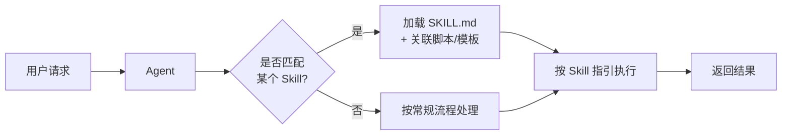
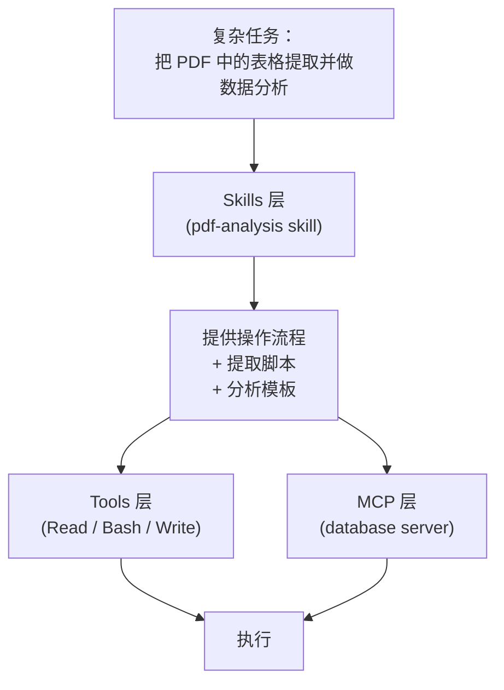
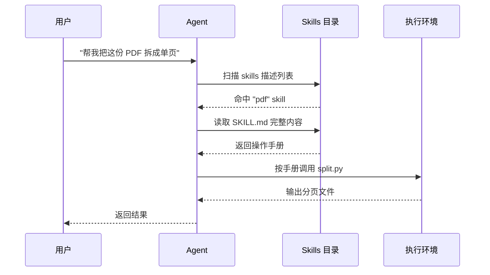

## 什么是 Agent Skills

**Skill（技能）** 是一种为 AI Agent 提供"可按需加载的专业能力包"的机制。它的核心思想是把一类任务的**操作手册、脚本、模板**封装到一个目录里，让 Agent 在需要时自动发现、加载并使用它。

与其把所有专业知识一股脑塞进系统提示里，不如按领域拆成一个个独立的 Skill：

- PDF 处理 → `pdf` skill
- 创建 PPT → `pptx` skill
- Git 提交 → `commit` skill
- 数据分析 → `data-analysis` skill

Agent 平时只需要知道这些 skill 的"名字 + 描述"，**真正用到时才读取完整内容**。这种"渐进式知识加载"让 Agent 既保持精简的上下文，又能处理复杂的专业任务。

<Note>
Skills 不是取代 Tools 或 MCP，而是一层更高的抽象：Tools 描述"能做什么动作"，Skills 描述"该怎么完成某类任务"。
</Note>

## 为什么需要 Skills

### 传统方式的局限

不使用 Skills 时，Agent 通常有两种知识来源：

| 方式 | 优点 | 缺点 |
|------|------|------|
| **System Prompt** | 永远可用 | 占用 token、所有任务都要背 |
| **Tools/函数调用** | 可执行动作 | 只描述"能做什么"，不描述"怎么做好" |
| **RAG 检索** | 知识量大 | 检索结果不稳定、缺乏结构 |
| **人工指令** | 精确 | 用户每次都要重复说 |

当任务具备"**操作流程化**、**需要额外脚本/模板**、**复用频率高**"这几个特征时，以上方式都不够优雅。

### Skills 的定位



Skill 扮演的角色是：**把一类任务的最佳实践变成 Agent 随时可调用的"专家模块"**。

## Skill 的结构

一个典型的 Skill 就是文件系统上的一个目录，最核心的是 `SKILL.md`：

```text
.claude/skills/
└── pdf/
    ├── SKILL.md           # 必须：元数据 + 操作说明
    ├── scripts/
    │   ├── extract.py     # 可选：可执行脚本
    │   └── merge.py
    ├── templates/
    │   └── report.html    # 可选：模板资源
    └── examples/
        └── sample.pdf     # 可选：示例数据
```

### SKILL.md 头部

```markdown
---
name: pdf
description: >-
  Use this skill whenever the user wants to do anything with PDF files.
  This includes reading, extracting text/tables, merging, splitting,
  rotating pages, adding watermarks, or creating PDFs.
---

## When to Use

...

## How to Use

...
```

两个关键字段：

- **`name`**：skill 的唯一标识，调用时使用
- **`description`**：**决定 Agent 何时自动加载这个 skill 的关键**。写得越具体、越包含触发关键词，命中率越高

## Skills vs Tools vs MCP

这三者常被混为一谈，但定位完全不同：

| 维度 | Tools | MCP | Skills |
|------|-------|-----|--------|
| **抽象层级** | 原子动作 | 远程能力通道 | 任务级工作流 |
| **形态** | 函数签名 | Server 进程 | Markdown + 资源文件 |
| **作用** | 让 Agent "能做" | 让 Agent "接入" | 让 Agent "做好" |
| **加载时机** | 对话开始时注入 | 会话建立时握手 | 按需匹配加载 |
| **携带资源** | ✗ | 有限 | ✓ 任意脚本/模板 |
| **编写成本** | 低 | 中 | 低 |



一句话总结：**Tools 是手，MCP 是外接设备，Skills 是说明书**。

## Skill 的加载流程



整个过程的关键：

1. **发现**：Agent 启动时只看到 skill 的 name + description 列表（上下文开销极低）
2. **匹配**：根据用户请求匹配合适的 skill
3. **加载**：把整个 `SKILL.md` 读入上下文
4. **执行**：按手册中的流程调用脚本或工具
5. **清理**：任务结束后 skill 内容可以淡出上下文

## 常见 Skill 分类

| 类别 | 典型 Skill | 用途 |
|------|-----------|------|
| **文档处理** | `pdf`、`docx`、`pptx`、`xlsx` | 读写 Office / PDF 文件 |
| **代码工作流** | `commit`、`review-pr`、`release` | 固化 Git/发布流程 |
| **数据分析** | `data-viz`、`sql-query` | 数据提取与可视化 |
| **内容创作** | `blog-post`、`readme-gen` | 按模板产出文章 |
| **集成运维** | `deploy`、`log-analysis` | 部署 / 排障手册 |
| **个人定制** | `my-style`、`project-x` | 你自己的偏好 |

## Skill 的分发方式

Skill 作为纯文件目录，分发非常灵活：

- **项目级**：放在 `.claude/skills/`，随仓库一起分发
- **个人级**：放在 `~/.claude/skills/`，所有项目共享
- **团队共享**：通过 Git 仓库或内部包管理
- **社区分享**：打包成 `.zip` 或发布到 skill registry

## 适合做成 Skill 的场景

✅ **适合**：

- 有**固定流程**但又需要一定判断力的任务
- 需要**配套脚本/模板**才能完成的任务
- 跨项目/跨场景**高频复用**的工作流
- 希望**沉淀团队最佳实践**的领域

❌ **不适合**：

- 一次性、无复用价值的临时需求
- 纯数据查询（更适合做成 MCP）
- 需要长期后台运行的服务（更适合做成独立 agent）
- 只是一两行提示词能解决的事

## 小结

Skills 是 AI Agent 从"通用助手"走向"专业工种"的关键一步：

- **Tools** 让 Agent 有手有眼
- **MCP** 让 Agent 连接世界
- **Skills** 让 Agent 真正"懂业务"

下一章 [创建自定义 Skill](/ai/skills/creating) 将手把手教你写出第一个可用的 skill。
