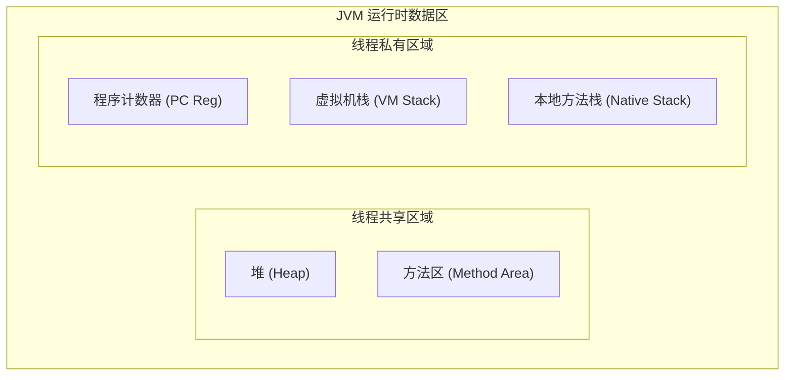
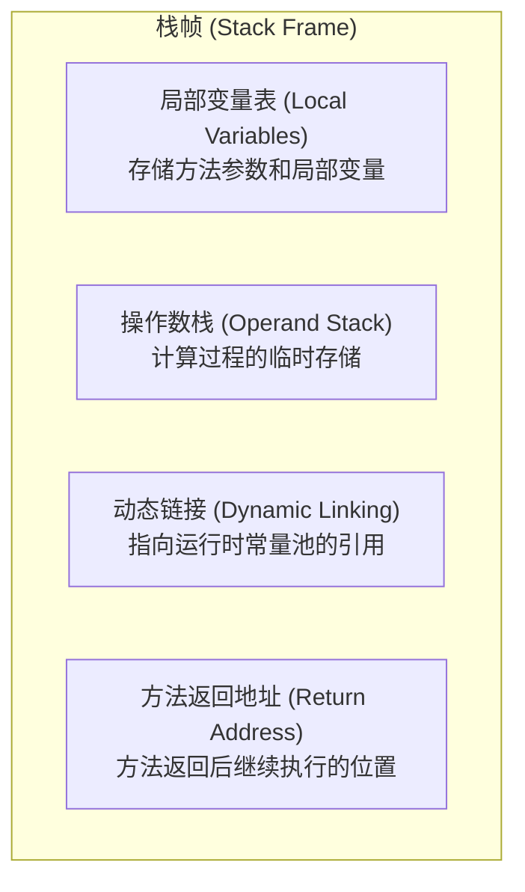
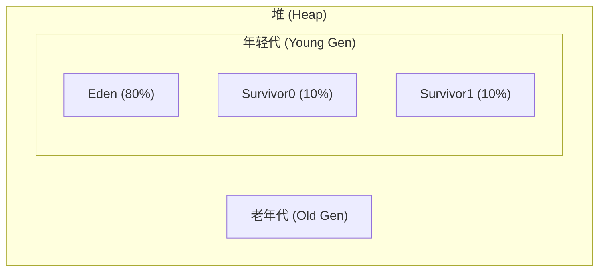
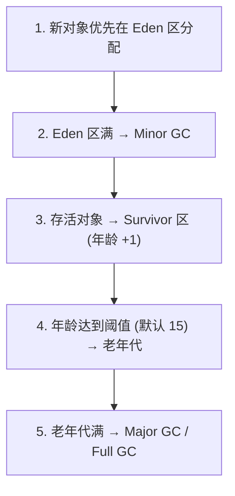
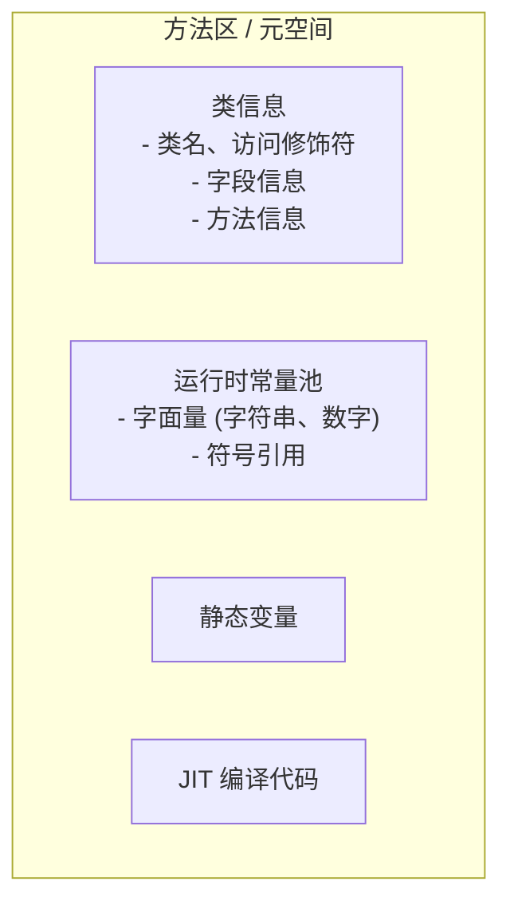

JVM 在执行 Java 程序时，会把它管理的内存划分为若干个不同的数据区域。这些区域有各自的用途、创建和销毁时间。

## 运行时数据区



## 程序计数器（PC Register）

程序计数器是一块较小的内存空间，用于存储当前线程正在执行的字节码指令地址。

### 特点

- **线程私有**：每个线程都有自己的程序计数器
- **唯一不会 OOM**：不会发生 OutOfMemoryError
- **执行 Native 方法时为空**：此时计数器值为 undefined

### 作用

```java
public int add(int a, int b) {
    int c = a + b;    // 程序计数器记录当前执行到这里
    return c;         // 然后更新为这里的地址
}
```

## 虚拟机栈（VM Stack）

虚拟机栈是 Java 方法执行的内存模型，每个方法执行时都会创建一个栈帧。

### 栈帧结构



### 局部变量表

存储方法参数和局部变量，以 Slot 为单位。

| 数据类型                               | Slot 数量 |
| -------------------------------------- | --------- |
| boolean, byte, char, short, int, float | 1         |
| long, double                           | 2         |
| reference                              | 1         |

```java
public void method(int a, long b) {
    double c = 3.14;
    // 局部变量表：
    // Slot 0: this（非静态方法）
    // Slot 1: a (int)
    // Slot 2-3: b (long)
    // Slot 4-5: c (double)
}
```

### 操作数栈

用于计算过程中的临时存储。

```java
int a = 1;
int b = 2;
int c = a + b;

// 字节码执行过程：
// iconst_1    → 操作数栈：[1]
// istore_1    → 操作数栈：[]，局部变量表：a=1
// iconst_2    → 操作数栈：[2]
// istore_2    → 操作数栈：[]，局部变量表：b=2
// iload_1     → 操作数栈：[1]
// iload_2     → 操作数栈：[1, 2]
// iadd        → 操作数栈：[3]
// istore_3    → 操作数栈：[]，局部变量表：c=3
```

### 栈溢出

```java
// StackOverflowError 示例
public void recursion() {
    recursion();  // 无限递归，栈帧不断压入
}
```

### 相关参数

```bash
# 设置栈大小（默认 1MB）
-Xss256k
-Xss1m
```

## 本地方法栈（Native Method Stack）

与虚拟机栈类似，但用于执行 Native 方法（C/C++ 实现）。

```java
// native 方法
public native void nativeMethod();
```

## 堆（Heap）

堆是 JVM 管理的最大内存区域，用于存放对象实例。

### 堆内存结构（JDK 8）



### 对象分配过程



### 堆内存参数

```bash
# 初始堆大小
-Xms512m

# 最大堆大小
-Xmx1024m

# 年轻代大小
-Xmn256m

# Eden 与 Survivor 比例（默认 8:1:1）
-XX:SurvivorRatio=8

# 年轻代与老年代比例
-XX:NewRatio=2
```

### OutOfMemoryError

```java
// 堆内存溢出示例
public class HeapOOM {
    public static void main(String[] args) {
        List<byte[]> list = new ArrayList<>();
        while (true) {
            list.add(new byte[1024 * 1024]);  // 不断创建 1MB 对象
        }
    }
}
// java.lang.OutOfMemoryError: Java heap space
```

## 方法区（Method Area）

方法区用于存储类信息、常量、静态变量、即时编译器编译后的代码等。

### JDK 版本变化

| 版本         | 实现                | 存储位置 |
| ------------ | ------------------- | -------- |
| JDK 7 及之前 | 永久代（PermGen）   | 堆内存   |
| JDK 8 及之后 | 元空间（Metaspace） | 本地内存 |

### 方法区内容



### 运行时常量池

```java
public class ConstantPoolDemo {
    // 字面量
    private String str = "hello";
    private int num = 100;
    
    // 符号引用
    public void method() {
        System.out.println(str);  // 方法引用
    }
}
```

### 元空间参数

```bash
# 初始元空间大小
-XX:MetaspaceSize=128m

# 最大元空间大小（默认无限制）
-XX:MaxMetaspaceSize=256m
```

### 元空间溢出

```java
// 元空间溢出示例（动态生成大量类）
public class MetaspaceOOM {
    public static void main(String[] args) {
        while (true) {
            // 使用 CGLib 动态生成类
            Enhancer enhancer = new Enhancer();
            enhancer.setSuperclass(Object.class);
            enhancer.setCallback((MethodInterceptor) (o, m, a, p) -> p.invokeSuper(o, a));
            enhancer.create();
        }
    }
}
// java.lang.OutOfMemoryError: Metaspace
```

## 直接内存（Direct Memory）

直接内存不属于 JVM 运行时数据区，但也被频繁使用。

### 特点

- 不受 JVM 堆大小限制
- 减少数据拷贝，IO 性能更好
- 分配和回收成本较高

### 使用场景

```java
// NIO 使用直接内存
ByteBuffer buffer = ByteBuffer.allocateDirect(1024 * 1024);
```

### 参数配置

```bash
# 设置直接内存大小
-XX:MaxDirectMemorySize=256m
```

## 内存区域总结

| 区域       | 线程 | 作用            | 异常                    |
| ---------- | ---- | --------------- | ----------------------- |
| 程序计数器 | 私有 | 记录执行位置    | 无                      |
| 虚拟机栈   | 私有 | 方法执行        | StackOverflowError, OOM |
| 本地方法栈 | 私有 | Native 方法执行 | StackOverflowError, OOM |
| 堆         | 共享 | 对象实例        | OutOfMemoryError        |
| 方法区     | 共享 | 类信息、常量    | OutOfMemoryError        |

## 小结

- **程序计数器**：线程私有，记录执行位置，唯一不会 OOM
- **虚拟机栈**：线程私有，方法执行的栈帧
- **堆**：线程共享，对象实例存储，GC 主要区域
- **方法区**：线程共享，类信息和常量池，JDK 8 后为元空间
- 理解内存结构是理解 GC 和调优的基础
