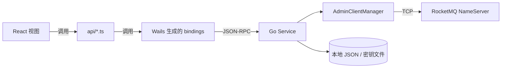
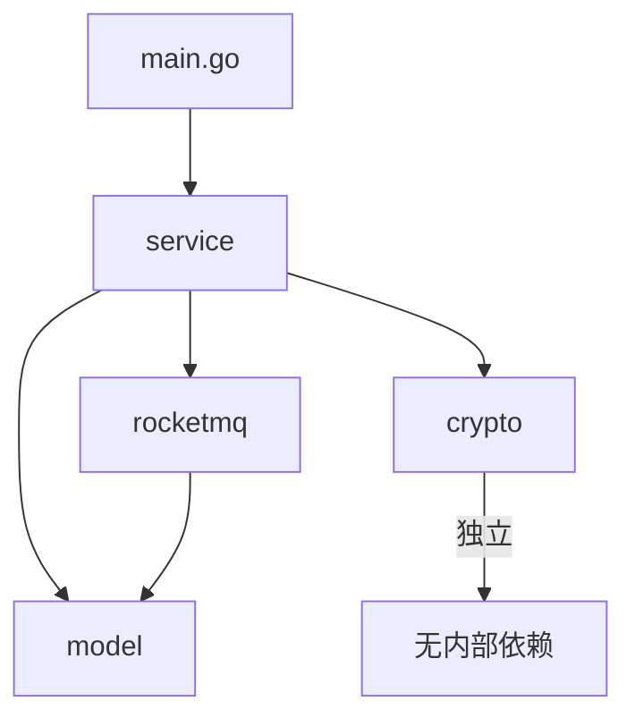

## 目录结构

```
rocket-leaf/
├── main.go                 # 应用入口，Wails 初始化与 Service 注册
├── go.mod / go.sum
├── Taskfile.yml            # 构建任务（开发、打包）
├── internal/               # Go 后端核心代码
│   ├── model/              # 数据模型（DTO / 领域对象）
│   │   ├── connection.go
│   │   ├── cluster.go
│   │   ├── topic.go
│   │   ├── consumer.go
│   │   ├── message.go
│   │   ├── acl.go
│   │   └── settings.go
│   ├── crypto/             # AES-256-GCM 加解密工具
│   │   └── crypto.go
│   ├── rocketmq/           # RocketMQ Admin 客户端封装
│   │   └── client.go
│   └── service/            # 业务服务层（绑定给前端）
│       ├── connection_service.go
│       ├── cluster_service.go
│       ├── topic_service.go
│       ├── consumer_service.go
│       ├── message_service.go
│       ├── settings_service.go
│       ├── acl_service.go
│       └── client_retry.go
├── frontend/               # React 前端
│   ├── src/
│   │   ├── App.tsx
│   │   ├── components/     # 视图组件
│   │   ├── api/            # 对 bindings 的薄封装
│   │   ├── hooks/          # useXxx 数据拉取
│   │   └── lib/
│   └── bindings/           # Wails 自动生成的 TS 绑定
└── build/                  # Wails 构建产物与平台资源
```

## 模块职责

### `internal/model`

纯数据结构，无副作用。定义连接、集群、Topic、消费者、消息等领域对象。所有字段都带 `json` tag，可以直接落盘或返回给前端。

### `internal/crypto`

AES-256-GCM 加解密工具包，用来保护 `AccessKey` / `SecretKey` 等敏感字段。密钥在 `UserConfigDir/rocket-leaf/secret.key` 首次启动时随机生成并持久化。

### `internal/rocketmq`

封装 `amigoer/rocketmq-admin-go`，对外暴露一个全局单例 `AdminClientManager`：

- 按 NameServer 地址维护客户端池
- 支持默认连接的懒初始化（首次访问时才建立）
- 提供 `TestConnection` 临时客户端做连通性检查

### `internal/service`

业务服务层，Wails 会把这一层的 `*Service` 实例直接暴露给前端调用。每个 service 职责单一：

| Service | 职责 |
| ------- | ---- |
| `ConnectionService` | 连接配置 CRUD、连接/断开、默认连接维护、加密落盘 |
| `ClusterService` | 查询集群状态、Broker 列表、健康信息 |
| `TopicService` | Topic 增删改查、路由信息 |
| `ConsumerService` | 消费者组信息、Offset 重置、订阅关系 |
| `MessageService` | 消息查询、发送测试消息、消息轨迹 |
| `SettingsService` | 应用设置读写（主题、超时等） |
| `AclService` | ACL 规则管理 |

> `client_retry.go` 是一个横切工具，被多个 service 共用，用来处理"连接已断 → 自动重连 → 重放"的场景。

### `frontend`

前端是一个典型的 React + Vite 项目：

- `components/*` 一个视图对应一个文件，直接使用顶层 `App.tsx` 管理导航状态
- `api/*` 对 Wails 生成的绑定做一层薄封装，把错误统一打日志后再抛出
- `hooks/*` 封装 `useConnections` / `useTopics` 这种"加载+刷新+错误"的通用模式
- `bindings/` 由 Wails 自动生成，**不需要手写也不要手动修改**，里面是 Go service 方法对应的 TS 签名

## 数据流向



关键点：

1. **前端没有直接访问 RocketMQ**，所有操作都通过 Wails 桥接到 Go service
2. **连接配置落盘之前必定加密**，读取时自动解密，前端拿到的始终是明文
3. **AdminClientManager 是全局单例**，避免每次请求都建立新连接
4. **默认连接懒加载**：应用启动时不会立刻连，只有在用户第一次访问业务接口时才尝试连接，避免启动卡顿

## 依赖方向



依赖关系严格单向：**service 依赖 rocketmq + model + crypto，rocketmq 不反向依赖 service**。这让 `rocketmq` 和 `crypto` 两个包都可以被其他项目直接复用。

## 前端 ↔ 后端的桥接

Wails v3 的做法很特别：开发时运行 `wails3 dev`，CLI 会扫描被注册到 `application.Options.Services` 的 struct，**自动为每个导出方法生成 TypeScript 绑定**，写入 `frontend/bindings/`。

例如：

```go
// internal/service/connection_service.go
func (s *ConnectionService) GetConnections() []*model.Connection { ... }
```

对应生成：

```ts
// frontend/bindings/.../connectionservice.js
export async function GetConnections(): Promise<(Connection | null)[]> { ... }
```

因此前端调用 `ConnectionService.GetConnections()` 时有**完整的类型提示**，且参数/返回值类型都来自 Go 的 struct 定义，避免手写契约带来的不一致。

下一章我们看看 Wails v3 本身的核心概念与用法。
