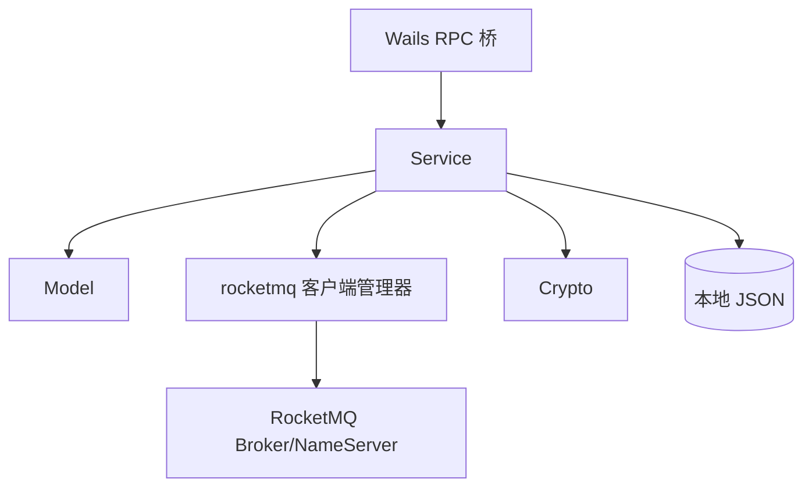
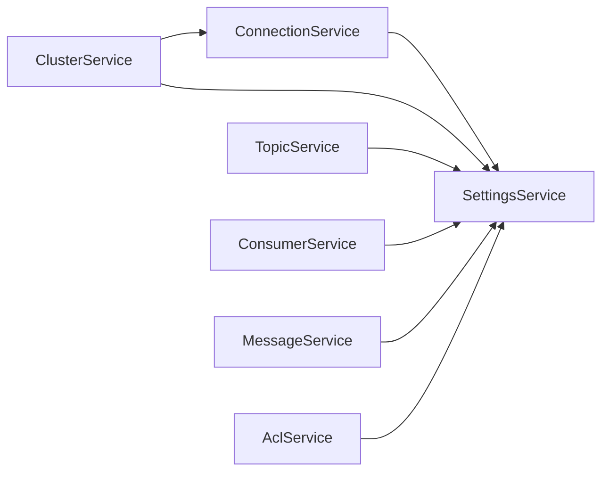

## 三层划分

Rocket-Leaf 后端刻意保持了非常薄的分层：



| 层 | 路径 | 职责 | 是否有状态 |
| -- | ---- | ---- | ---------- |
| **Model** | `internal/model` | 纯数据结构，带 `json` tag | 无 |
| **Infra** | `internal/rocketmq`、`internal/crypto` | 对外部依赖的封装 | 有（客户端池 / 密钥） |
| **Service** | `internal/service` | 业务逻辑，暴露给前端 | 有（配置缓存、持久化） |

故意**没有** Controller / DAO / Repository 这种分层 —— 对一个桌面应用来说这些都是过度设计。Service 就是桥接层，直接被前端调用。

## Service 之间的依赖

服务之间不是完全独立的，有明确的依赖方向：



- `SettingsService` 最基础，没有依赖，所有人都读它的超时/主题等全局设置
- `ConnectionService` 依赖 Settings，负责连接配置的读写与加密
- 其他业务 service（Topic / Consumer / Message / ACL）**不直接依赖 ConnectionService**，而是通过 `rocketmq.GetClientManager()` 拿默认客户端

::note{title="为什么不让 Topic/Consumer 直接依赖 Connection"}
如果 Topic/Consumer 直接依赖 ConnectionService，就要显式传入或维护对它的引用，且所有 service 会形成一张图。通过全局 `ClientManager`，这些业务 service 只需要关心"拿到一个可用的 admin.Client"就行，解耦了连接管理与业务操作。这是一个典型的 **Service Locator** 取舍 —— 牺牲一点可测试性换取代码简洁。
::

## Service 的标准形态

一个 service 的骨架长这样：

```go
type ConnectionService struct {
    mu              sync.RWMutex
    connections     map[int]*model.Connection
    nextID          int
    dataFilePath    string
    settingsService *SettingsService
}

func NewConnectionService(settingsService *SettingsService) *ConnectionService {
    service := &ConnectionService{
        connections:     make(map[int]*model.Connection),
        nextID:          1,
        dataFilePath:    resolveConnectionDataFilePath(),
        settingsService: settingsService,
    }
    if err := service.loadConnectionsFromFile(); err != nil {
        log.Printf("[ConnectionService] 加载连接配置失败: %v", err)
    }
    return service
}
```

几个要点：

1. **显式注入依赖**（`settingsService`），而不是全局单例 —— 便于测试时替换
2. **构造时初始化状态**：从磁盘加载配置，失败只打日志不阻塞
3. **`sync.RWMutex` 保护内存状态**：Wails 的 service 方法可能被前端并发调用
4. **`map[int]*model.Connection`** 做主键索引，避免每次遍历
5. **`nextID`** 维护自增 ID，避免依赖数据库

## 持久化策略

连接配置持久化到 `$UserConfigDir/rocket-leaf/connections.json`，格式是一个简单的包装：

```go
type connectionStore struct {
    Connections []*model.Connection `json:"connections"`
}
```

读写逻辑：

```go
func (s *ConnectionService) saveConnectionsLocked() error {
    connections := make([]*model.Connection, 0, len(s.connections))
    for _, conn := range s.connections {
        connCopy := *conn
        // 加密敏感字段后再写入文件
        if connCopy.AccessKey != "" {
            encrypted, _ := crypto.Encrypt(connCopy.AccessKey, "accessKey")
            connCopy.AccessKey = encrypted
        }
        if connCopy.SecretKey != "" {
            encrypted, _ := crypto.Encrypt(connCopy.SecretKey, "secretKey")
            connCopy.SecretKey = encrypted
        }
        connections = append(connections, &connCopy)
    }
    sort.Slice(connections, func(i, j int) bool {
        return connections[i].ID < connections[j].ID
    })
    data, err := json.MarshalIndent(connectionStore{Connections: connections}, "", "  ")
    // ... os.WriteFile
}
```

设计上值得注意的几点：

- **拷贝后再加密**：`connCopy := *conn` 先拷贝一份，加密写入文件，内存里仍然保留明文
- **按 ID 排序**：保证每次写入的 JSON 文件稳定，有利于用户 diff、人工编辑和 git 备份
- **`saveConnectionsLocked` 必须在已持有锁的上下文中调用**：函数名以 `Locked` 结尾是 Go 社区的一个惯例

## 输入规范化

用户输入是脏的，service 必须清洗。Rocket-Leaf 里有一组 `normalizeXxx` 函数：

```go
func normalizeConnectionEnv(env model.ConnectionEnv) model.ConnectionEnv {
    if env != model.EnvProduction && env != model.EnvTest && env != model.EnvDevelopment {
        return model.EnvDevelopment
    }
    return env
}

func normalizeACLConfig(enableACL bool, ak, sk string) (bool, string, string, error) {
    ak = strings.TrimSpace(ak)
    sk = strings.TrimSpace(sk)
    if !enableACL {
        return false, "", "", nil
    }
    if ak == "" {
        return false, "", "", fmt.Errorf("启用 ACL 时 AccessKey 不能为空")
    }
    if sk == "" {
        return false, "", "", fmt.Errorf("启用 ACL 时 SecretKey 不能为空")
    }
    return true, ak, sk, nil
}

func normalizeTimeoutSec(timeoutSec int) int {
    if timeoutSec <= 0 {
        return defaultConnectionTimeout
    }
    return timeoutSec
}
```

为什么要这样做：

- **防御式编程**：前端表单有 bug / 老数据不合法时，后端仍然能落到合理的默认值
- **集中校验规则**：新增字段约束时只改一处，所有调用点自动生效
- **配合兼容老数据**：从磁盘加载 JSON 时，对每条记录都过一遍 normalize，避免把非法状态带进内存

## 默认连接的处理

列表里有且仅有一个 `IsDefault == true` 的连接：

```go
// 从文件加载时做兜底
if len(loaded) > 0 && !hasDefault {
    minID := 0
    for id := range loaded {
        if minID == 0 || id < minID {
            minID = id
        }
    }
    loaded[minID].IsDefault = true
}
```

- 如果加载的数据里**没有**默认连接，就自动把 ID 最小的那条设为默认
- 如果有**多条**默认连接（数据损坏），只保留第一条
- 不会抛错，永远能恢复到合法状态

## 小结

- **分层要轻**：service 直接对接前端，不要引入不必要的 Controller/DAO
- **依赖要明确**：必要的依赖显式注入，不必要的（比如跨业务的）走全局 locator
- **状态要清洗**：输入归一、输出排序、加载兜底
- **持久化要简单**：能用 JSON 就别上数据库，备份、diff、调试都容易得多

下一章我们深入看 `rocketmq.AdminClientManager` 的多客户端管理与懒加载实现。
