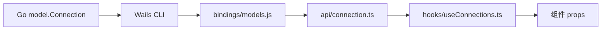

## 目录概览

```
frontend/
├── index.html
├── vite.config.ts
├── tailwind.config.js
├── tsconfig.json
├── bindings/                # Wails 自动生成的 TS 绑定（不手动改）
│   └── rocket-leaf/internal/...
└── src/
    ├── main.tsx             # React 入口
    ├── App.tsx              # 顶层导航 + 路由
    ├── index.css            # 全局样式 + tailwind
    ├── components/          # 视图组件
    ├── api/                 # 对 bindings 的薄封装
    ├── hooks/               # 数据加载 hooks
    └── lib/
        └── utils.ts         # 工具函数
```

## 技术选型

| 层 | 选型 | 理由 |
| -- | ---- | ---- |
| 框架 | React 19 | 桌面应用的 UI 复杂度适中，React 生态最成熟 |
| 构建 | Vite | 启动快、HMR 友好，和 Wails dev 模式无缝衔接 |
| 样式 | TailwindCSS | 配合 shadcn 风格的 `components/ui/`，改动成本低 |
| Toast | sonner | API 极简，动画漂亮，适合桌面应用 |
| 状态 | React state + 自定义 hooks | 没用 Redux/Zustand，数据量和交互复杂度撑不起 |

**刻意不引入**的东西：

- **React Router**：导航由 `App.tsx` 的 `activeNav` state 管理，路径根本不暴露给用户
- **全局状态库**：跨组件共享的只有"连接列表"这类数据，放在 hook 里就够
- **表单库**：表单种类少，`useState` + 受控组件足矣

## 自动生成的 bindings

Wails CLI 会扫描 `application.Options.Services` 里注册的每个 struct，把它们的**导出方法**生成 TypeScript 绑定：

```
frontend/bindings/rocket-leaf/internal/
├── model/
│   └── models.js           # Connection / Topic / ... 类型定义
└── service/
    ├── connectionservice.js
    ├── clusterservice.js
    ├── topicservice.js
    └── ...
```

文件命名规则：**全小写**（`ConnectionService` → `connectionservice.js`），方法名保留原样（`GetConnections` → `GetConnections`）。

::note{title="bindings 是生成物，不要手动修改"}
每次 `wails3 dev` 或 `wails3 build` 都会重新生成 `frontend/bindings/`。任何手动改动都会被覆盖。如果需要调整前端拿到的类型，应该改 Go 侧的 struct 定义。
::

## api 层：薄封装

直接调用 bindings 是可行的，但 Rocket-Leaf 在 `src/api/` 再包了一层：

```ts
// frontend/src/api/connection.ts
import * as ConnectionService from '../../bindings/rocket-leaf/internal/service/connectionservice.js'
import type { Connection } from '../../bindings/rocket-leaf/internal/model/models.js'

export async function getConnections(): Promise<(Connection | null)[]> {
  try {
    return await ConnectionService.GetConnections()
  } catch (e) {
    console.error('GetConnections', e)
    throw e
  }
}

export async function addConnection(
  name: string,
  env: string,
  nameServer: string,
  timeoutSec: number,
  enableACL: boolean,
  accessKey: string,
  secretKey: string,
  remark: string,
): Promise<Connection | null> {
  try {
    return await ConnectionService.AddConnection(
      name, env, nameServer, timeoutSec, enableACL, accessKey, secretKey, remark,
    )
  } catch (e) {
    console.error('AddConnection', e)
    throw e
  }
}
```

这一层只做三件事：

1. **统一错误日志**：每个调用都 `console.error` 打点，排查问题时看一眼 DevTools 就能定位
2. **重新抛出异常**：由上层决定 Toast 提示还是重试
3. **命名转换**：`ConnectionService.GetConnections` → `getConnections`，更贴合 JS 习惯

虽然看起来是重复代码，但**边界层的样板是有价值的**：未来想加 tracing、加 mock、加节流，都只需要改这一处。

## hooks 层：通用加载模式

桌面应用里最常见的模式是"**加载数据 → 显示 loading → 出错提示 → 手动刷新**"。Rocket-Leaf 把它抽象成了 `useXxx` 系列 hook：

```ts
// frontend/src/hooks/useConnections.ts
import { useState, useEffect, useCallback } from 'react'
import type { Connection } from '../../bindings/rocket-leaf/internal/model/models.js'
import * as connectionApi from '@/api/connection'
import { formatErrorMessage } from '@/lib/utils'

export function useConnections() {
  const [list, setList] = useState<(Connection | null)[]>([])
  const [loading, setLoading] = useState(true)
  const [error, setError] = useState<string | null>(null)

  const refresh = useCallback(async () => {
    setLoading(true)
    setError(null)
    try {
      const data = await connectionApi.getConnections()
      setList(data)
    } catch (e) {
      setError(formatErrorMessage(e))
      setList([])
    } finally {
      setLoading(false)
    }
  }, [])

  useEffect(() => {
    refresh()
  }, [refresh])

  return {
    list: list.filter(Boolean) as Connection[],
    loading,
    error,
    refresh,
  }
}
```

几个细节：

- **`list.filter(Boolean)`**：Wails 返回的可能是 `(T | null)[]`（因为 Go 的 `*model.Connection` 可能为 `nil`），在这里把 `null` 过滤掉
- **`refresh` 用 `useCallback` 包起来**：避免每次渲染产生新函数导致子组件无谓重新渲染
- **`useEffect(() => { refresh() }, [refresh])`**：组件挂载即触发一次加载
- **返回 `refresh`**：上层可以在写操作后手动触发刷新

### 使用方式

```ts
// App.tsx
const {
  list: connections,
  loading: connectionsLoading,
  error: connectionsError,
  refresh: refreshConnections,
} = useConnections()

const handleConnect = useCallback(async (id: number) => {
  await connectionApi.connect(id)
  await connectionApi.setDefaultConnection(id)
  await refreshConnections()  // 写操作后主动刷新
  await refreshTopics()
  await refreshConsumerGroups()
  toast.success('连接成功')
}, [refreshConnections, refreshTopics, refreshConsumerGroups])
```

这种模式的好处是**可预测**：任何写操作之后都能用 `refresh` 同步最新状态，不依赖乐观更新。

## App.tsx：状态集中

`App.tsx` 是整个应用的**状态中心**，持有：

- 当前激活的侧边栏（`activeNav`）
- 当前正在连接/断开的 ID（`connectingId` / `disconnectingId`）
- 从 hooks 拉到的 `connections` / `topics` / `consumerGroups`

子组件只接收 props + 回调，**不直接调用 API**。这样的好处是：

1. 数据流是单向的，容易 debug
2. 组件可以被单独 render（Storybook / 测试）
3. 跨组件的联动都在 App.tsx 里可见，避免"隐式依赖"

缺点是 `App.tsx` 会变长，但目前量级（7 个视图）完全可控。

## 导航：不用 Router 的做法

```tsx
const [activeNav, setActiveNav] = useState<NavId>('home')

return (
  <div>
    <IconSidebar active={activeNav} onChange={setActiveNav} />
    <main>
      {activeNav === 'home' && <OverviewView ... />}
      {activeNav === 'connections' && <ConnectionManagement ... />}
      {activeNav === 'topics' && <TopicList ... />}
      {activeNav === 'consumers' && <ConsumerGroupList ... />}
      {activeNav === 'messages' && <MessageView ... />}
      {activeNav === 'cluster' && <ClusterView ... />}
      {activeNav === 'settings' && <SettingsView ... />}
      {activeNav === 'acl' && <AclView ... />}
    </main>
  </div>
)
```

桌面应用的 URL 既不用分享也不用回溯，上 `react-router` 只会增加包体积与心智负担。`useState` + 条件渲染就够了。

## 连接前置：ConnectionGate

很多视图都要求**已经有活跃连接**才能用。Rocket-Leaf 抽了一个 `ConnectionGate` 组件做前置校验：

```tsx
<ConnectionGate
  hasConnected={hasConnected}
  onOpenConnections={handleOpenConnections}
>
  <TopicList ... />
</ConnectionGate>
```

`ConnectionGate` 的逻辑：

- `hasConnected === true`：直接渲染 `children`
- `hasConnected === false`：渲染一个引导页，告诉用户"先去连接管理建立一个连接"

这种**高阶组件式**的封装比在每个视图里写 `if (!hasConnected) return <EmptyState />` 简洁得多，也避免了代码重复。

## 错误提示：sonner toast

所有写操作统一用 toast 反馈：

```ts
try {
  await connectionApi.connect(id)
  toast.success('连接成功')
} catch (e) {
  toast.error(formatErrorMessage(e))
}
```

`formatErrorMessage` 把 Error 对象、字符串、未知类型统一转成友好文案。桌面应用里 toast 比 alert 体验好得多 —— 不阻塞操作、会自动消失。

## TypeScript 类型链

整个前端的类型从 Go struct 流向 TS：



任何一处 Go struct 改动，重新运行 `wails3 dev` 后 TS 编译器立刻会在对应的消费点报错。这是 Wails 相对于 Electron 最大的工程优势之一：**契约是自动同步的**。

## 小结

- **bindings 是生成物**，信任它，不要手动改
- **api 层是边界**，薄一点、重复一点没关系，它是未来扩展的抓手
- **hook 层是通用模式**，把"加载/错误/刷新"抽象成一个可复用的形状
- **App 是大脑**，子组件只负责展示与回调
- **TypeScript 的类型链让前后端契约自动对齐**，这正是选择 Wails 的最大收益

整个系列到这里告一段落。希望这份文档既能帮助你以后回顾自己写过的代码，也能让第一次看到 Rocket-Leaf 的读者快速上手。
