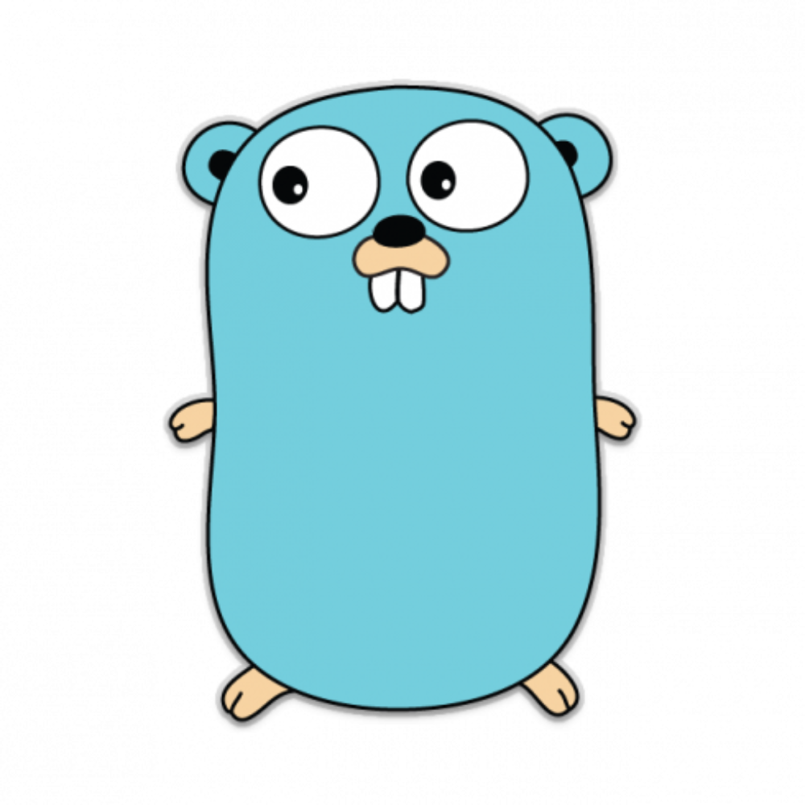

# CoderMast

<!-- <div align="center">
  
</div> -->

<div align="center">
  <strong>全栈技术学习指南 — 从编程语言到云原生的一站式知识平台</strong>
</div>

<div align="center">
  <br/>
  <a href="https://github.com/amigoer/codermast/stargazers"></a>
  <a href="https://github.com/amigoer/codermast/network/members"></a>
  <a href="https://github.com/amigoer/codermast/issues"></a>
  <a href="https://github.com/amigoer/codermast/blob/main/LICENSE"></a>
  <br/>
  
  
  
</div>

<br/>

CoderMast 是一个面向开发者的全栈技术学习平台，涵盖编程语言、后端技术、云原生、数据库、消息队列、前端开发、项目实战、面试宝典等内容。

## 内容导航

### 编程语言

| 模块       | 内容                                                                                       |
| :--------- | :----------------------------------------------------------------------------------------- |
| **Golang** | 核心基础、并发编程、GMP 调度、内存模型、GC、Web 开发（Gin / GORM）、分布式、工程化、标准库 |
| **Java**   | 核心语法、集合框架、IO 流、多线程、JVM                                                     |

### 后端框架

| 模块            | 内容                                          |
| :-------------- | :-------------------------------------------- |
| **Spring 系列** | Spring、Spring MVC、Spring Boot、Spring Cloud |

### 数据库与中间件

| 模块         | 内容                      |
| :----------- | :------------------------ |
| **数据库**   | MySQL、Redis              |
| **消息队列** | Kafka、RabbitMQ、RocketMQ |

### 云原生与运维

| 模块           | 内容                      |
| :------------- | :------------------------ |
| **容器与编排** | Docker、Kubernetes、CI/CD |
| **系统与服务** | Linux、Nginx              |

### 前端开发

| 模块         | 内容  |
| :----------- | :---- |
| **前端框架** | Vue 3 |

### 开发工具

| 模块         | 内容                       |
| :----------- | :------------------------- |
| **工具链**   | Git、Maven、IDEA、Homebrew |
| **编程思想** | 设计模式                   |

### 项目实战

| 项目         | 内容                           |
| :----------- | :----------------------------- |
| **苍穹外卖** | 前端搭建、后端开发、数据库设计 |

### 面试宝典

| 技术栈         | 内容                             |
| :------------- | :------------------------------- |
| **Golang**     | 基础、并发、GMP、内存、GC        |
| **MySQL**      | 索引、事务、锁、优化、主从复制   |
| **Redis**      | 数据类型、持久化、集群、缓存     |
| **RocketMQ**   | 顺序/延迟/事务消息、可靠性、存储 |
| **Kubernetes** | Pod、Service、Deployment、调度   |

## 快速开始

```bash
# 克隆项目
git clone https://github.com/amigoer/codermast.git

# 安装依赖
pnpm install

# 本地运行
pnpm dev

# 构建部署
pnpm build
```

## 技术栈

- **框架**: [Fumadocs](https://fumadocs.dev) + Next.js
- **内容**: Markdown / MDX
- **样式**: TailwindCSS
- **部署**: Vercel

## 参与贡献

欢迎各种形式的贡献！

- **报告 Bug**：发现问题请提交 [Issue](https://github.com/amigoer/codermast/issues)
- **功能建议**：有好的想法欢迎在 Issue 中讨论
- **完善文档**：修复错误、补充内容、优化排版
- **提交代码**：Fork 项目后提交 Pull Request

```bash
# 1. Fork 本项目
# 2. 克隆你 Fork 的仓库
git clone https://github.com/YOUR_USERNAME/codermast.git

# 3. 创建新分支
git checkout -b feature/your-feature

# 4. 提交更改
git commit -m "feat: add some feature"

# 5. 推送并创建 Pull Request
git push origin feature/your-feature
```

### 贡献者

感谢所有为本项目做出贡献的开发者！

<a href="https://github.com/amigoer/codermast/graphs/contributors">
  
</a>

## Star 趋势

> 如果这个项目对你有帮助，欢迎点个 Star 支持一下！

[](https://star-history.com/#amigoer/codermast&Date)

## License

本项目采用 [CC BY-NC-SA 4.0](./LICENSE) 许可协议。
